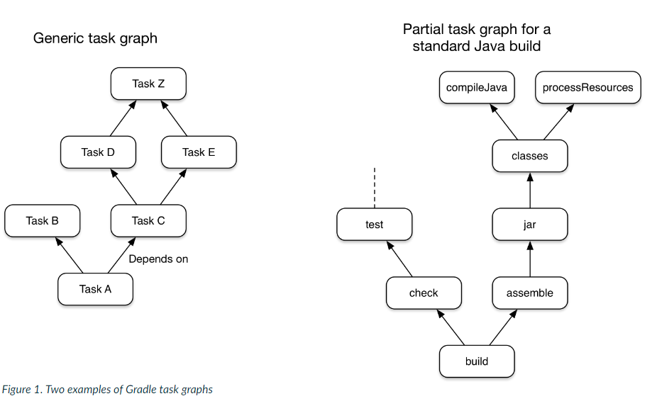

# 概述
Gradle是一个开源构建自动化工具，它设计的灵活性可以构建几乎任何类型的软件。以下是对一些最重要特性的高级概述：
* **高性能**。  

    Gradle通过只运行需要运行的任务来避免不必要的工作，因为它们的输入或输出已经改变。您还可以使用构建缓存来重用以前运行的任务输出，或者甚至从不同的计算机（使用共享构建缓存）。
    
    还有很多其他优化，Gradle实现和它的开发团队也在不断地提高Gradle的性能。
* **JVM 基础支持**

    Gradle在JVM上运行的，因此你需要安装JDK才能使用它。对于熟悉Java平台的用户来说，这是一个额外的好处，因为您可以在构建逻辑中使用标准的Java APIs，比如定制任务类型和插件。它还可以很容易地在不同的平台上运行Gradle。

    请注意，Gradle并不局限于只构建JVM项目，它甚至还附带了对构建本地项目的支持。
* **Conventions[ 约定 ]**

    Gradle借鉴了Maven的书，使常见类型的项目（如Java项目）易于实现约定来构建。应用适当的插件，您就可以很容易地结束许多项目的瘦构建脚本。但是这些习俗并没有限制你：Gradle允许您复盖它们，添加您自己的任务，并对基于约定的构建进行许多其他定制。

    > Conventions 一词应该指的是maven中的项目类型；比如是普通的java项目还是web项目

* **可扩展性**

    您可以轻松地扩展Gradle以提供您自己的任务类型，甚至构建模型。

* **IDE支持**

    支持的IDE有Android Studio、IntelliJ IDEA、Eclipse和NetBeans。也有对Visual Studio的解决方案

* **Insight[ 眼光，洞察力 ]**

    构建扫描(Build scans)提供了有关构建运行的广泛信息，您可以使用这些信息来识别构建问题。他们特别擅长于帮助您识别与构建的性能相关的问题。您还可以与其他人共享构建扫描，如果您需要在修复构建中的问题时征求建议，这一点特别有用。

    > Build scans ( ex: gradlew.bat 任务 --scan) 可以提供项目构建中的详细信息

# 关于Gradle你需要知道的五件事

Gradle是一个灵活而强大的构建工具，当您第一次开始时，您很容易感到可怕。然而，理解以下核心原则将使Gradle更易于接近，并且您将在了解它之前熟练地使用它。

1. **Gradle是一个通用的构建工具**

    Gradle允许您构建任何软件，因为它对您试图构建的内容或应该如何构建的内容几乎不做任何假设。最值得注意的限制是依赖管理目前只支持与Maven和Ivy兼容的存储库和文件系统。

    这并不意味着您必须做大量的工作来创建一个构建。通过添加一个约定层和通过插件预先构建功能，Gradle使构建常见类型的项目（比如Java库）变得容易了。您甚至可以创建和发布自定义插件来封装自己的约定和构建功能。

2. **核心模型是基于任务的**

    Gradle将其构建建模为任务（工作单元）的有向无环图（DAGs）。这意味着构建实质上配置了一组任务，并根据依赖关系将它们连接在一起，以创建该DAG。创建任务关系图后，Gradle将确定需要以何种顺序运行哪些任务，然后继续执行这些任务。
    
    这个图表显示了两个任务图示例，一个是抽象的，另一个是具体的，任务之间的依赖关系用箭头表示：
    

    几乎任何构建过程都可以用这种方式建模为任务图，这也是为什么Gradle如此灵活的原因之一。这个任务图可以由插件和您自己的构建脚本定义，任务通过任务依赖机制链接在一起。

    任务本身包括：
    * **Actions** - 一些执行某些操作的工作，如复制文件或编译源代码
    * **Inputs** - 操作或操作所使用的值、文件和目录
    * **Outputs** - 操作修改或生成的文件和目录

    事实上，所有这些都是可选的，这取决于任务需要做什么。有些任务（例如标准生命周期任务）甚至没有任何操作。为了方便，他们只是简单地将多个任务聚合在一起。

    > 您可以选择要运行的任务。通过指定您需要的任务来节省时间。如果您只是想运行单元测试，那么选择执行该操作的任务 —通常是测试。如果您想打包一个应用程序，大多数构建都有一个用于此目的的组装任务。

    最后一件事：Gradle的增量构建支持是健壮且可靠的，因此通过避免使用clean任务来保持构建快速运行，除非您确实想要执行干净。

3. Gradle有几个固定的构建阶段

    重要的是要理解，Gradle从三个阶段评估和执行构建脚本：

    1. 初始化

        为构建创建环境并确定哪些项目将参与其中。

    2. 配置

        根据用户希望运行的任务构造和配置构建任务图，然后确定需要运行哪些任务以及以何种顺序运行。

    3. 执行

        运行在配置阶段结束时选择的任务。
    
    这些阶段构成了Gradle的构建生命周期。

    > ### 与Apache Maven术语的比较
    > Gradle的构建阶段与Maven的阶段不同。Maven使用其阶段将构建执行划分为多个阶段。它们的作用与Gradle的任务图相似，尽管不太灵活。
    > Maven的构建生命周期概念与Gradle的生命周期任务有些类似，**参考Gradle 的 base插件**。

    设计良好的构建脚本主要由声明性配置组成，而不是命令式逻辑。这种配置在配置阶段进行评估是可以理解的。即便如此，许多这样的构建也有任务操作(例如通过doLast{}和doFirst{}块——在执行阶段对其进行评估)。这很重要，因为在配置阶段评估的代码将不会看到在执行阶段发生的更改。

    配置阶段的另一个重要方面是，每次运行构建时都会对其中涉及的所有内容进行评估。这就是为什么最好的做法是在配置阶段避免昂贵的工作。构建扫描可以帮助您识别这样的热点等。

4. **Gradle以多种方式扩展**

    如果只使用与Gradle捆绑在一起的构建逻辑来构建您的项目将是非常好的，但这很少有可能。大多数构建都有一些特殊的需求，这意味着您需要添加自定义构建逻辑。

    Gradle提供了几种允许您扩展它的机制，例如：

    * **Custom task types [自定义任务类型]**

        当您希望构建执行一些现有任务无法完成的工作时，只需编写您自己的任务类型即可。通常，最好将定制任务类型的源文件放在buildSrc目录或打包的插件中。然后您可以使用自定义任务类型，就像任何Gradle提供的一样。
    
    * **Custom task actions [自定义任务执行器]**

        您可以附加通过task.doFirst()和task.doLast()方法在任务之前或之后执行的自定义构建逻辑。

    * **Extra properties on projects and tasks [项目和任务的附加属性。]**

        这允许您将自己的属性添加到一个项目或任务，然后您可以从自己的自定义任务执行器或任何其他构建逻辑中使用这些属性。附加的属性甚至可以应用到你没有显式创建的任务上，比如那些由Gradle核心插件创建的任务。

    * **Custom conventions[自定义约定]**

        >** 约定** 一次参考本文概述中的 **Conventions[ 约定 ]**

        约定是简化构建的一个强大方法，这样用户就可以更容易地理解和使用它们。这可以从使用标准项目结构和命名约定（如Java构建）的构建中看出。您可以编写自己的插件来提供构建的相关方面配置需要的默认值。

    * **A custom model [自定义模型]**

        Gradle允许您将新概念引入到构建之外的任务、文件和依赖关系配置。您可以在大多数语言插件中看到这一点，这些插件将源集的概念添加到构建中。对构建过程进行适当的**建模**可以极大地提高构建的易用性和效率。

5. **构建脚本对API进行操作**

    很容易将Gradle的构建脚本看作可执行代码，因为它们就是这样。但这是一个实现细节：设计良好的构建脚本描述了构建软件需要哪些步骤，而不是这些步骤应该如何完成工作，这是一个自定义任务类型和插件的工作。

    > 有一种常见的误解，即Gradle的能力和灵活性来自于它的构建脚本就是代码。这完全与事实不符。正是底层模型和API提供了这种能力。正如我们在我们的最佳实践中推荐的那样，您应该避免在构建脚本中放入很多（如果有的话）命令性的逻辑。

    然而，在一个领域中，将构建脚本看作可执行代码是非常有用的：了解构建脚本的语法如何映射到Gradle的API。API文档(由[Groovy DSL Reference](https://docs.gradle.org/5.0/dsl/) 和 [Javadocs](https://docs.gradle.org/5.0/javadoc/overview-summary.html) 组成)列出了方法和属性，并引用了闭包和操作。在构建脚本的上下文中，这些意味着什么？查看[Groovy构建脚本入门](https://docs.gradle.org/5.0/userguide/groovy_build_script_primer.html#groovy_build_script_primer)，以了解这个问题的答案，这样您就可以有效地使用API文档了。

    > 当Gradle在JVM上运行时，构建脚本也可以使用标准Java API。Groovy构建脚本还可以使用Groovy APIs，而Kotlin构建脚本可以使用Kotlin的脚本。
