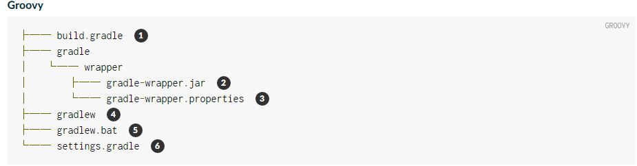

# 创建新的Gradle构建

按照本指南，您将创建一个简单的Gradle项目，调用一些基本的Gradle命令，并了解Gradle如何管理项目。

## 你需要什么

* 大约11分钟
* 终端应用程序(terminal application)
* jre或jdk，版本要求8及以上；仅Gradle运行时需要
* 一个[Gradle环境(Gradle distribution)](安装Gradle[installing_Gradle].md)，版本要求4.10-rc-2及以上

> 演示将基于unix的系统显示shell命令。Windows对每个命令都有类似的命令。

## 初始化项目

首先，让我们创建一个我们的项目将进入的新目录。

> mkdir basic-demo
> cd basic-demo

现在我们可以使用Gradle的init命令来生成一个简单的项目。我们将探索所生成的一切以便你准确了解发生了什么。

> gradle init

* 如果你想使用Kotlin DSL，请使用gradle init--dsl kotlin。见[文档](https://docs.gradle.org/4.10-rc-2/userguide/build_init_plugin.html#sec:what_to_set_up)了解详细信息。

该命令应显示"BUILD SUCCESSFUL"并生成以下"空"项目。如果没有，请确保正确安装 Gradle ，并确保正确JAVA_HOME设置了环境变量。

这就是Gradle为您生成的内容。



1. **配置脚本**；用于配置当前项目的Gradle构建脚本
2. [Gradle Wrapper](https://docs.gradle.org/4.10-rc-2/userguide/gradle_wrapper.html)可执行JAR
3. Gradle Wrapper配置属性
4. 基于Unix的系统的Gradle Wrapper脚本
5. 适用于Windows的Gradle Wrapper脚本
6. 配置Gradle构建的Gradle设置(settings)脚本

> gradle init可以[生成各种不同类型的项目](https://docs.gradle.org/4.10-rc-2/userguide/build_init_plugin.html#sec:build_init_types)，甚至知道如何将简单pom.xml文件转换为Gradle。

我们可以就这样结束指南，但是你可能很想知道如何在项目中使用Gradle。让我们一起来做

## 创建一个任务
Gradle提供了用于通过基于Groovy或基于Kotlin的DSL创建和配置任务的APIs。一个[Project](https://docs.gradle.org/4.10-rc-2/dsl/org.gradle.api.Project.html)包括一组[Task](https://docs.gradle.org/4.10-rc-2/dsl/org.gradle.api.Task.html)，每个任务执行一些基本操作。

Gradle附带了一个任务库，您可以在自己的项目中配置这些任务。例如，有一个名为Copy的核心类型，它将文件从一个位置复制到另一个位置。["Copy"](https://docs.gradle.org/4.10-rc-2/dsl/org.gradle.api.tasks.Copy.html)任务非常有用，但在这里我们只列举一个简单的示例。

1. 创建一个名为src的目录。
2. 在src目录中添加一个名为myfile.txt的文件。内容是任意的（它甚至可以是空的），但为了方便添加单行"hello world!"。
3. 在构建文件中定义一个类型为Copy(注意大小写)，名称为copy的任务，将src目录复制到名为dest的新目录。你不需要创建dest目录，任务会帮你完成

```
task copy(type: Copy, group: "Custom", description: "Copies sources to the dest directory") {
    from "src"
    into "dest"
}
```
在这里，group和description可以由你来设置。您甚至可以省略它们，但这样做也会从任务报告中省略它们。

现在执行你新建的copy任务

> ./gradlew copy

你可以通过检查目录中的文件及内容，验证它是否按预期工作

## 应用一个插件

Gradle包含了一系列插件，在Gradle插件门户上还有很多很多插件。该发行版附带的base插件是插件之一。结合调用该插件的核心类型Zip，您可以使用配置的名称和位置创建项目的zip存档。

使用插件语法将基本插件添加到您的构建脚本文件中。请确保在文件顶部添加plugins{}块。

```
plugins {
    id "base"
}

... 生成文件的其余部分 ...
```
现在添加一个从src目录创建一个zip存档的任务。
```
task zip(type: Zip, group: "Archive", description: "Archives sources in a zip file") {
    from "src"
    setArchiveName "basic-demo-1.0.zip"
}
```

插件与你的配置一起工作，在build/distributions文件夹下创建一个名为basic-demo-1.0.zip的存档文件

下面只需运行新的压缩任务，并查看生成的zip文件是否在您期望的位置。

> ./gradlew zip

## 探索和调试您的构建

让我们看看在新项目中我们还能对Gradle做些什么。[命令行参考](https://docs.gradle.org/4.10-rc-2/userguide/command_line_interface.html)

### 查看可用的 tasks

tasks 命令列出了您可以调用的Gradle任务，包括由基本插件添加的任务，以及您刚才添加的自定义任务。

> ./gradlew tasks

### 分析和调试您的构建

Gradle还为构建提供了一个丰富的基于网络的视图，称为[构建扫描](https://scans.gradle.com/?_ga=2.253634889.1764517437.1550653915-1449148275.1550653915)。

通过使用该 **--scan**选项或通过将构建扫描插件明确应用于项目，构建信息会发送到scans.gradle.com服务器。要将数据保存在自己的服务器上，请查看[Gradle Enterprise](https://gradle.com/enterprise?_ga=2.223774811.1764517437.1550653915-1449148275.1550653915)。

尝试通过在执行任务时添加 **--scan**来创建构建扫描。

> ./gradlew zip --scan

如果您浏览构建扫描，您应该能够很容易地发现执行了哪些任务，执行了多长时间，应用了哪些插件等等。下次在StackOverflow上调试时，请考虑共享构建扫描。

### 发现可用的属性

properties命令会告诉你关于项目属性的信息。

> ./gradlew properties

输出很多。这里只是一些可用的属性：

```
> Task :properties

------------------------------------------------------------
Root project
------------------------------------------------------------

buildDir: /Users/.../basic-demo/build
buildFile: /Users/.../basic-demo/build.gradle
description: null
group:
name: basic-demo
projectDir: /Users/.../basic-demo
version: unspecified

BUILD SUCCESSFUL
```

默认情况下，**name**与文件夹的名称匹配。您还可以指定**group**和**version**属性，但是此时它们采用它们的默认值，**description**也是一样。

buildFile属性是您的构建脚本的完全限定路径名，默认情况下它在projectDir下。

您可以更改许多属性。例如，您可以尝试将以下行添加到构建脚本文件中，然后重新执行./gradlew properties。

```
description = "A trivial Gradle build"
version = "1.0"
```