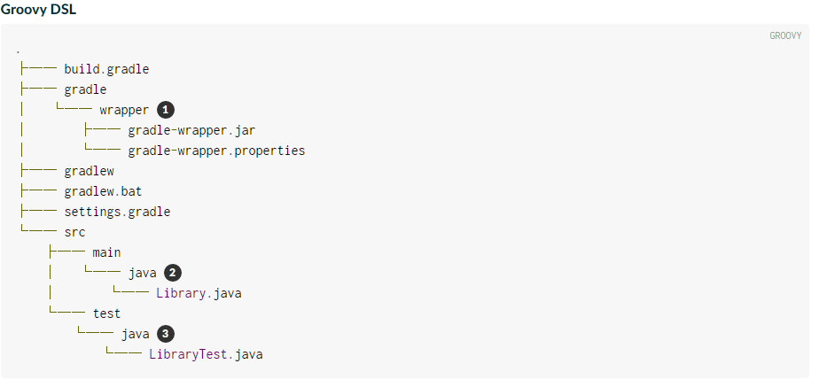
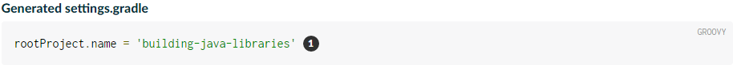
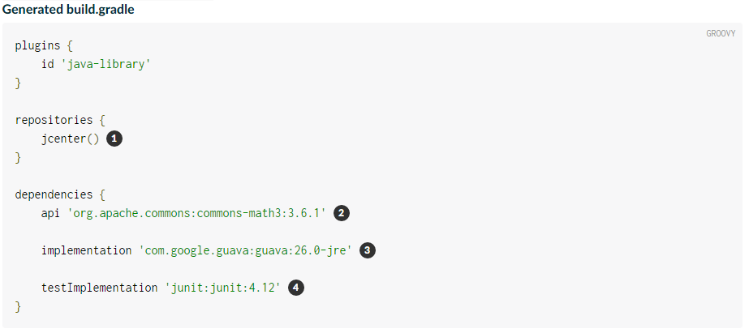
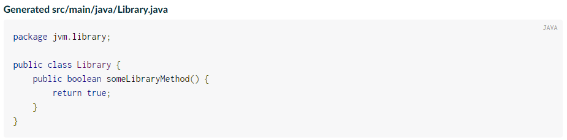
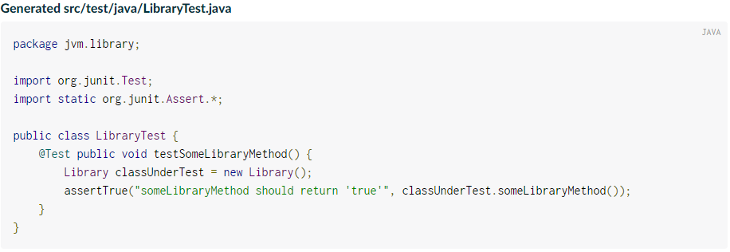
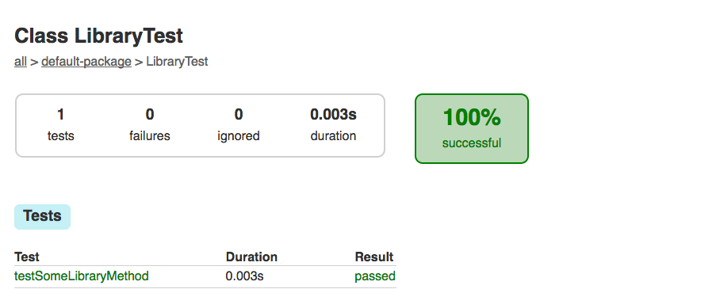

# 构建Java Libraries
本指南将指导您完成使用Gradle的Build Init插件生成适合其他JVM库和应用程序使用的JVM库的过程。

## 你要构建什么
你将使用标准布局来生成java Library

## 你需要什么
* 大约11分钟
* 文本编辑器或者IDE
* JDK8+
* 一个[Gradle环境(Gradle distribution)](安装Gradle[installing_Gradle].md)，版本要求5.0及以上

## 创建一个library项目
Gradle带有一个内置的插件，叫做Build Init插件。它记录在[Gradle用户手册](https://docs.gradle.org/current/userguide/build_init_plugin.html)。这个插件有一个任务init用于生成项目，init任务调用（也是内置的）wrapper任务来创建Gradle wrapper 脚本gradlew。

第一步是为新项目创建一个文件夹并将目录更改为该文件夹。

> mkdir building-java-libraries

> cd building-java-libraries

## 运行init任务
从新项目目录内部，使用java-library参数运行init任务。

> gradle init --type java-library --project-name jvm-library

也可以直接运行gradle init，在选择项目类型的时候选择java-library

init 任务首先运行wrapper任务，这将生成gradlew 和 gradlew.bat wrapper脚本，然后他会以以下结构创建新项目


1. 生成wrapper文件的文件夹
2. 默认的java源文件夹
3. 默认的Java测试文件夹

您现在拥有了一个简单Java库项目的必要组件。

## 查看生成的项目文件

settings文件有大量注释，但只有一行活动行


这将指定根项目的名称。

生成的build.gradle文件也有许多注释。活动部分在这里(注意依赖项的版本号可以在以后的Gradle版本中更新)

1. 指定仓库
2. 这是导出到使用者的依赖项的一个例子，也就是说，在他们的编译类路径中找到。
3. 这是一个在内部使用的依赖项的示例，该依赖项不会在其自己的编译类路径上向使用者公开
4. JUnit测试库

构建脚本添加了java-library插件。这是java-base插件的扩展，并添加了用于编译Java源代码的其他任务。

还有如下的类文件


生成的测试类有一个Junit4测试。测试实例化Library类，调用someLibraryMethod方法，并检查返回的值是否为true

## 组装library JAR
要构建项目，请运行build任务。您可以使用常规的gradle命令，但是当项目包含wrapper脚本时，使用它被认为是一个好的形式。

> ./gradlew build

        第一次运行wrapper脚本gradlew时,会在你的~/.gradle/wrapper/dists文件夹中下载和保存gradle版本信息，这可能会有延迟

第一次运行构建时，Gradle将检查您的~/.gradle目录中是否已在缓存中拥有JUnit库和其他列出的依赖项。如果没有，库将被下载并存储在那里。下次运行构建时，将使用缓存版本。build任务会编译类、运行测试并生成测试报告。

您可以通过打开位于build/reports/tests/test/index.html的HTML输出文件查看测试报告。

这里显示一个示例报告


你可以在build/libs 目录中找到新打包的JRA文件building-java-libraries.jar;可以使用压缩工具打开JAR文件并查看其中的内容是否是预期的结果。

所有这些都发生在构建脚本中，没有任何额外的配置，因为Gradle的java-library插件假设您的项目源是按照[常规的项目布局](https://docs.gradle.org/5.0/userguide/java_plugin.html#sec:java_project_layout)安排的。如果您愿意，可以按照[用户手册](https://docs.gradle.org/5.0/userguide/java_plugin.html#sec:changing_java_project_layout)中的描述定制项目布局。

刚刚我们完成了创建一个Java库的第一步！现在可以根据自己的项目需求对其进行定制。

## 自定义library JAR

如果你希望在jar文件的名称中包含版本，你可以在构建脚本中设置顶级属性version来实现：

**build.gradle**
```
version = '0.1.0'
```

再次运行构建命令你会发现在build/libs目录中生成了一个名称为building-java-libraries-0.1.0.jar的JAR文件

另一个常见的需求是自定义manifest文件，通常是要添加一个或多个属性；如果我们要把库名称和版本添加到manifest文件中，我们可以这样配置

**build.gradle**
```
jar {
    manifest {
        attributes('Implementation-Title': project.name,
                   'Implementation-Version': project.version)
    }
}
```
再次运行构建命令然后打开JAR文件中的META-INF/MANIFEST.MF清单文件

**META-INF/MANIFEST.MF**
```
Manifest-Version: 1.0
Implementation-Title: building-java-libraries
Implementation-Version: 0.1.0
```

manifest属性只是jar任务上众多的配置属性之一，有关完整的列表，可以点击一下链接
* [Jar section](https://docs.gradle.org/5.0/dsl/org.gradle.api.tasks.bundling.Jar.html)
* [Gradle Language Reference](https://docs.gradle.org/5.0/dsl/)
* [Jar](https://docs.gradle.org/5.0/userguide/java_plugin.html#sec:jar)
* [Creating Archives](https://docs.gradle.org/5.0/userguide/working_with_files.html#sec:archives)
* [User Manual](https://docs.gradle.org/5.0/userguide/userguide.html)

## 添加API文档
java-library 通过javadoc任务内置了对Java API文档工具的支持。

你可以在代码中以标准的格式添加或修改注释，然后运行javadoc任务

>  ./gradlew javadoc

你可以打开位于build/docs/javadoc/index.html的HTML文件查看生成的JavaDoc文档

## 总结

您现在已经成功构建了一个Java库项目，将其打包为JAR并在单独的应用程序中使用它，你也学会了如何
* 生成java library
* 适应生成的build.gradle和示例Java文件的结构化
* build并查看测试报告
* 自定义jar名称和 manifest清单文件
* 生成API文档


代码示例已经上传到github，可以访问[链接](https://github.com/wangdunmin/practice-project.git)，查看practice-gradle/demo-java-library-gradle
