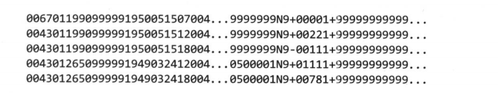
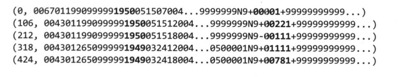
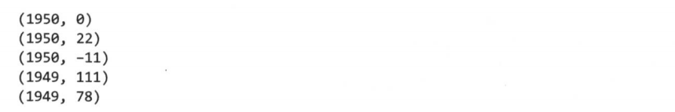
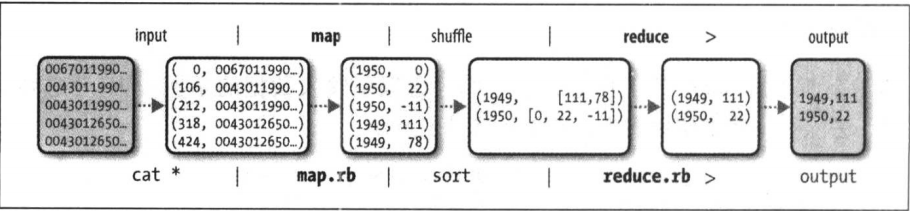
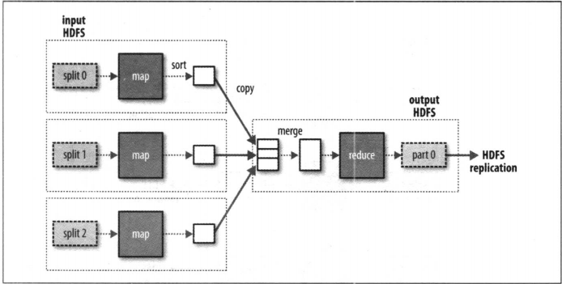
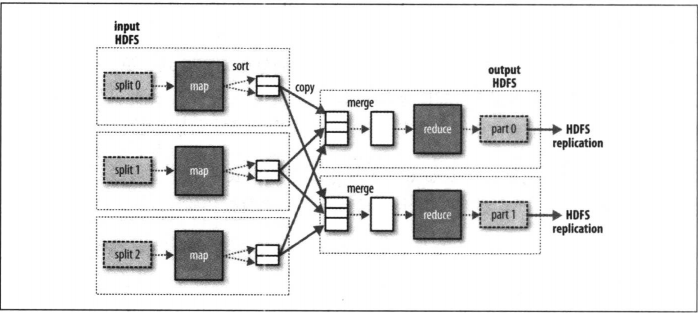
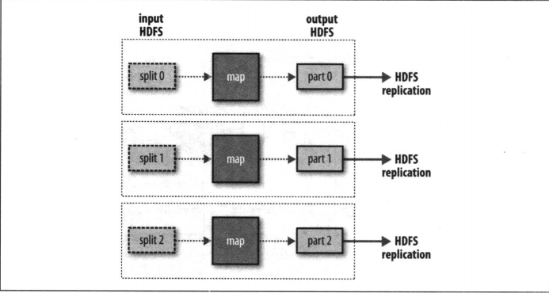
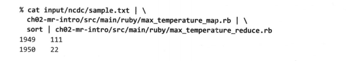
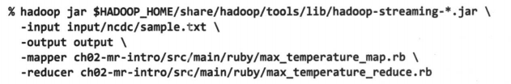
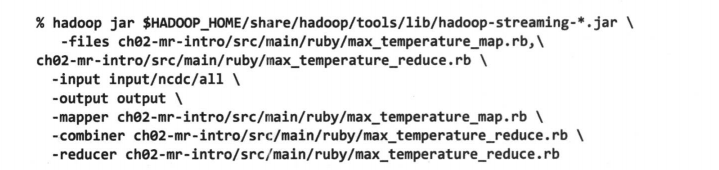

MapReduce是一种可用于数据处理的**编程模型**；这是一种简单的模型，但是想写出有用的程序却是不太容易。Hadoop支持各种语言版本的MapReduce程序，这包括Java，Python。MapReduce程序本质上是并行运行的；它的优势在于处理大规模数据集。

# 2.1 气象数据集

## 数据格式

数据是按照行存储的，每行数据以ASCII格式存储，这些数据有很多个小文件组成，我们需要将数据先组合成一个大文件，便于Hadoop高效的处理

# 2.2 使用UNIX工具来分析数据

为了与Hadoop进行有效的对比，使用awk工具编写一个程序脚本，用于计算每年的最高气温。

为了提高程序的处理速度，我们需要并行处理程序来分析数据，但这样做存在一些问题：

1. 划分任务块；任务很难平均的分配到每个处理程序上，使得处理程序得到完整的利用

2. 合并各个程序上的运行结果的方式各不相同

3. 单台计算机的运行速度有限；这时就需要多台设备，此时就需要考虑更多的问题，比如可靠性和协调性。

因此并行处理虽然可行，但很麻烦；使用Hadoop可以解决这些问题

# 2.3 使用Hadoop来分析数据

为了充分利用Hadoop提供的并行处理优势，需要将查询表示成MapReduce作业

## 2.3.1 map和reduce

MapReduce任务过程分两个处理阶段：
1. map阶段
2. reduce阶段

每个阶段以**Key-Value对**作为输入和输出，类型由程序员选择。程序员还需要写两个函数: map函数和reduce函数

map阶段将原始数据读取到处理程序中，将数据处理筛选后传入到reduce阶段，reduce函数将数据合并处理后得到最终数据；让我们使用Hadoop来找出气象数据中每一年中的最高气温。

在本示例中，map阶段的输入数据是气象数据，输入格式为文本格式；输入的key是当前行的起始位置相对于文件起始位置的偏移量，value是数据集中的某一行数据；map函数值提取数据行中的年份和气温值，并筛选掉垃圾数据。处理之后将结果输出到reduce的输入中，在reduce函数中找出最大值。

让我们以数据为例，列举出每一阶段数据的变化
* 原始数据



* 经过Hadoop处理之后的Map输入



* Map处理之后的输出



* 经过Hadoop处理之后的Reduce输入(此处是对Map输出的key-value进行排序和分组)


* Reduce处理之后的输出


整体的数据处理流程



## 2.3.2 Java MapReduce

整个实现过程分为三步

1. 实现map函数

    map函数可以通过实现Mapper类中的map方法

    ```java
    import java.io.IOException;

    import org.apache.hadoop.io.IntWritable;
    import org.apache.hadoop.io.LongWritable;
    import org.apache.hadoop.io.Text;
    import org.apache.hadoop.mapreduce.Mapper;
    
    // 正如前面所说，输入和输出的类型由程序员自己定义
    // 这里 输入的key是LongWritable类型的，等价于java中的Long，Hadoop对类型进行的包装使其可以处理更广泛的需求(可优化网络序列化传输)；表示行首相对于文件首的偏移位置
    // 输入的value为Text类型；表示某行数据
    // 输出的key为Text类型；表示年份
    // 输出的value为IntWritable；表示气温值
    public class MaxTemperatureMapper extends MapReduceBase implements Mapper<LongWritable,Text,Text,IntWritable> {

        private static final int MISSING = 9999;

        @Override
        public void map(LongWritable key, Text value, Context context) throws IOException,InterruptedException {
            // 将行数据转换为String
            String line = value.toString();
            // 获取年份
            String year = line.substring(15,19);
            // 解析气温值
            int airTemperature;
            if(line.charAt(87) == '+'){
                airTemperature = Intrger.parseInt(line.substring(88,92));
            }else{
                airTemperature = = Intrger.parseInt(line.substring(87,92))
            }
            // 检测值得有效性
            String quality = line.substring(92,93);
            if(airTemperature != MISSING && quality.matches("[01459]")){
                // 当值有效时，通过Context对象将数据传入到Reduce中
                // 第一个实参表示传入Reduce的key
                // 第二个实参表示传入Reduce的value
                // 这里必须和Reduce函数保持一致
                // Content用于输出内容的写入
                context.write(new Text(year),new IntWritable(airTemperature));
            }
        }
        

    }
    ```

2. 实现reduce函数

    reduce函数可以通过实现Reducer类中的reduce方法

    ```java
    import java.io.IOException;

    import org.apache.hadoop.io.IntWritable;
    import org.apache.hadoop.io.Text;
    import org.apache.hadoop.mapreduce.Reducer;

    // 如前所述，输入类型由程序员决定；不过此处有个限制，Reduce的输入必须和Map的输出类型保持一致
    public class MaxTemperatureReducer extends Reducer<Text,IntWritable,Text,IntWritable>{

        // key为年份值
        // value为由Map处理之后的当前年份下的气温值，由于数据记录的是当前的，所以某年中气温值有多个，所以使用了迭代器
        public void reduce(Text key, Iterable<IntWritable> values, Context context) throws IOException,InterruptedException {

            // 比较气温值
            int maxValue = Integer.Min_VALUE;
            for(IntWritable value : values){
                maxValue = Math.max(maxValue,value.get());
            }
            // 将最大值输出
            context.write(key, new IntWritable(maxValue));
        }
    }
    ```

3. 运行作业程序

    ```java
    import java.io.IOException;
    import org.apache.hadoop.fs.Path;
    import org.apache.hadoop.io.IntWritable;
    import org.apache.hadoop.io.Text;
    import org.apache.hadoop.mapreduce.Job;
    import org.apache.hadoop.mapreduce.input.FileOutputFormat;
    import org.apache.hadoop.mapreduce.input.FileInputFormat;

    public class MaxTemperature{

        public static void main(String[] args) throws Exception {
            // 校验输入参数
            if(args.length != 2){
                System.err.println("Usage: MaxTemperature <input path> <output path>");
                System.exit(-1);
            }

            // 创建运行MapReduce的工作
            Job job = new Job();
            // 设置jar包；由于在Hadoop上运行这个作业时，需要把代码打包成一个JAR文件
            // setJarByClass()方法接受一个类，Hadoop通过这个类查到到包含它的JAR文件，从而找到相关的JAR文件
            job.setJarByClass(MaxTemperature.class);
            job.setJobName("最高气温");

            // 添加工作的文件输入路径
            // 路径可以使单个的文件，一个目录(将目录下的所有文件当做输入)或符合特定文件模式的一系列文件
            // 函数名以add*开头，说明可以多次调用设置多条路径
            FileInputFormat.addInputPath(job,new Path(args[0]));
            // 设置工作的结果输出路径
            // 这里指的是reduce函数结果的输出目录
            // 注意：在运行前，该目录不应该存在，若果存在，Hadoop会报错并拒绝运行作业，这样坐是为了防止数据丢失(结果被意外覆盖)
            FileOutputFormat.setOutputPath(job,new Path(args(1)));

            // 设置mapper和reduce函数，在java中函数不能独立于类出现所以在此处设置类
            job.setMapperClass(MaxTemperatureMapper.class);
            job.setReducerClass(MaxTemperatureReducer.class);

            // 设置reduce的输出类型
            // 若map和reduce的输出类型相同时，可以不设置map的输出格式，如本例
            // 如果不同，则通过setMapOutputKeyClass和setMapOutputValueClass函数设置map的输出格式
            job.setOutputKeyClass(Text.class);
            job.setOutputValueClass(IntWritable.class);
            
            // 运行作业并依靠运行的结果停止JVM
            // waitForCompletion方法接受一个Boolean参数；表示是否生成详细的输出
            System.exit(job.waitForCompletion(true) ? 0 : 1);
        }

    }

    ```

测试之后查看结果目录下一个名为part-r-00000的文件可以看到：

    1949 111
    1950 22

表示1949年的最高温度为11.1摄氏度，1950年为2.2摄氏度

    > 测试运行步骤参考树中附录

# 2.4 横向扩展

前面只是对少量数据进行了处理，当我们遇到大量的数据流时，我们就要对系统进行横向扩展；为了实现这个目标，首先我们需要把大量的数据存储在分布式文件系统(HDFS)中；然后使用Hadoop的资源管理系统(YARN)将MapReduce计算转移到存储有部分数据的各个机器上。下面是具体过程

## 2.4.1 数据流

首先我们需要阐明一些术语：

**MapReduce作业**是客户端需要执行的一个工作单元：它包括输入数据，MapReduce程序及配置信息。Hadoop将作业分成若干个**任务**来执行；其中就包括map任务和reduce任务。这些任务运行在集群的**节点**上，通过YARN调度，当一个任务失败时，它会在另一个不通的节点上重新调度运行。

Hadoop将MapReduce输入的数据划分为等长的数据块，这被称为**输入分片**或者**分片**；Hadoop为每个分片构建一个map任务来处理用户自定义的map函数处理分片中的每条数据。

理论上，分片切的越小拥有的分片越多，处理完整个任务的时间会越少，负载平衡的质量也会更高；但是分片如果切的太小，那么管理分片和构建map任务的时间就会越多，在一个临界值之后，它会成为决定整个系统执行时间的关键。所一所以**分片的大小对整个任务的运行时间的影响很大**。一个合理的分片大小趋向于HDSF的一个块的带下，默认为128MB，这个值可以在集群范围或文件范围内指定。

Hadoop在存储数据的节点上运行任务时性能最佳，因为这时它不必在网络中读取数据。这就是**数据本地化优化**；有一种情况，存储数据的节点上可能在运行其它map任务，这时作业调度会寻找一个空闲的节点去执行这个map任务，这会使处理节点和数据节点之间使用网络带宽去加载数据。这种情况在极端情况下才会产生。这就是为什么最佳分片的大小应该与块带下相同的原因，如果分片大小大于块大小，那么数据就会跨越两个HDFS节点。

map任务将处理之后的数据存储在本地硬盘，而不是HDFS，这是因为map任务的是中间结果，它需要经过reduce任务处理周才有效，而且reduce任务执行后，map的输出结果将会被删掉。**如果map任务的节点在将中间结果传送给reduce任务之前失败，Hadoop将会在另一个节点上重新运行并生成中间结果**

**reduce任务不具备数据本地化的优势**，对于单个reduce任务(比如上面的例子)，它输入通常来自于所有map任务的输出，具体步骤为Hadoop将map的输出排序之后通过网络传输给运行reduce任务的节点上，数据在reduce端进行合并，然后由reduce函数进行处理；它的输出通常存储在HDFS中；为了实现数据的可靠性，Hadoop会将数据拷贝在其它节点中也存储一份；图示如下：



reduce任务的数量不是由数据大小决定的，它可以手动指定；当reduce任务为多个时，就会根据每个map任务的数据对其分区，每个reduce任务对应一个数据分区，每个分区有许多键(及对应的值)，单每个键对应的key-value对都在同一个分区中；分区也可以有用户自定义的分区函数控制，单一般情况下都是使用哈希函数来分区，这样很高效；多个reduce任务时，Hadoop会对map的数据进行shuffle(混洗)，因为每个reduce任务的输入都来自许多map任务，**调整混洗参数对执行时间的影响非常大**；详情看下图示：



还有一种情况，当数据处理可以完全并行(无需混洗时),可能会出现无reduce任务的情况，在这种情况下，唯一的非本地节点数据传输是将map任务的结果写入HDFS中；如图示：



## 2.4.2 combiner函数

集群上的可用贷款限制了MapReduce作业的数量，因此避免map和reduce任务之间的数据传输是有利的。Hadoop允许用户对map任务指定一个combiner函数，它的作用是将map输出数据合并，再传入reduce输入中，**这会减少map任务对reduce任务的数据传输量**；Hadoop无法确定对combiner函数的调用次数，但是它保证不管combiner函数调用多少次，reduce的输出结果都是相同的。

让我们举个例子说明这一切：

不用combiner函数之前，两个map任务的输出是这样的
```
    (1950,0)
    (1950,12)
    (1950,13)
```
```
    (1950,25)
    (1950,15)
```
reduce任务输入是这样的

```
    (1950,[0,12,13,25,15])
```
reduce任务的最终输出是这样的
```
    (1950,25)
```
我们使用combiner函数对每个map进行处理(在这里是找出每个map任务的最大气温值)之后reduce的输入将变成
```
    (1950,[13,25])
```
最终的结果是一样的

但是并非所有的业务都有可用的combiner函数，比如在算平均值时我们不能使用mean函数(平均函数)作为我们的combiner函数
````
    mean(0,20,10,25,15) = 14
````
而 
```
    mean(mean(0,20,10),mean(25,15)) = 15
```

### 指定一个combiner

combiner是通过Reducer类来定义的，在这个例子中，它和Reducer的实现函数相同，所以我们可以直接指定，不需要添加任何其它实现代码

```java
    import java.io.IOException;
    import org.apache.hadoop.fs.Path;
    import org.apache.hadoop.io.IntWritable;
    import org.apache.hadoop.io.Text;
    import org.apache.hadoop.mapreduce.Job;
    import org.apache.hadoop.mapreduce.input.FileOutputFormat;
    import org.apache.hadoop.mapreduce.input.FileInputFormat;

    public class MaxTemperature{

        public static void main(String[] args) throws Exception {
            // 校验输入参数
            if(args.length != 2){
                System.err.println("Usage: MaxTemperature <input path> <output path>");
                System.exit(-1);
            }

            // 创建运行MapReduce的工作
            Job job = new Job();
            // 设置jar包；由于在Hadoop上运行这个作业时，需要把代码打包成一个JAR文件
            // setJarByClass()方法接受一个类，Hadoop通过这个类查到到包含它的JAR文件，从而找到相关的JAR文件
            job.setJarByClass(MaxTemperature.class);
            job.setJobName("最高气温");

            // 添加工作的文件输入路径
            // 路径可以使单个的文件，一个目录(将目录下的所有文件当做输入)或符合特定文件模式的一系列文件
            // 函数名以add*开头，说明可以多次调用设置多条路径
            FileInputFormat.addInputPath(job,new Path(args[0]));
            // 设置工作的结果输出路径
            // 这里指的是reduce函数结果的输出目录
            // 注意：在运行前，该目录不应该存在，若果存在，Hadoop会报错并拒绝运行作业，这样坐是为了防止数据丢失(结果被意外覆盖)
            FileOutputFormat.setOutputPath(job,new Path(args(1)));

            // 设置mapper和reduce函数，在java中函数不能独立于类出现所以在此处设置类
            job.setMapperClass(MaxTemperatureMapper.class);
            job.setCombinderClass(MaxTemperatureMapper.class);
            job.setReducerClass(MaxTemperatureReducer.class);

            // 设置reduce的输出类型
            // 若map和reduce的输出类型相同时，可以不设置map的输出格式，如本例
            // 如果不同，则通过setMapOutputKeyClass和setMapOutputValueClass函数设置map的输出格式
            job.setOutputKeyClass(Text.class);
            job.setOutputValueClass(IntWritable.class);
            
            // 运行作业并依靠运行的结果停止JVM
            // waitForCompletion方法接受一个Boolean参数；表示是否生成详细的输出
            System.exit(job.waitForCompletion(true) ? 0 : 1);
        }

    }

```

## 24.3 运行分布式的MapReduce作业

这个程序不需要做任何修改就可以直接运行在大的数据集上，MapReduce可以根据数据量的带下和硬件规模进行扩展

2.5 Hadoop Streaming

这实际上是在系统标准输出流中输入和输出数据，步骤如下：

使用其它语言编写的map函数，Hadoop将这些map函数产生的结果排好序输出到标准输出流中，reduce从标准输入流中读取数据并处理之后输出到标准输出流中；当用其它语言写好map和reduce函数之后，使用Hadoop命令就可以运行

如下是Ruby函数的测试方式；可以看到由于它没有Hadoop框架的支持，所以需要对map的结果进行手动的sort




如下是通过Hadoop运行Ruby语言编写的函数



也可以指定combiner函数



java的MapReduce Api和Hadoop Streaming有一个差异需要提及一下：MapReduce Api的map函数一次只能处理一条数据，而Hadoop Streaming中这由程序员去决定，它可以同时处理若干行；MapReduce Api可以通过实例变量去实现但是这在本质上有着不同。

具体的map和reduce代码清单参考书中


