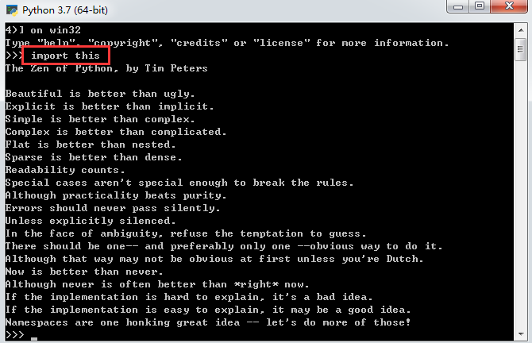
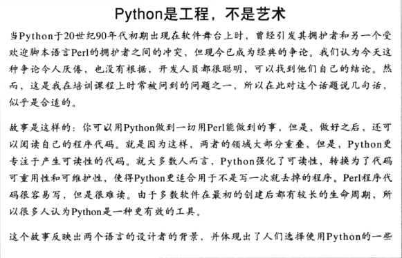
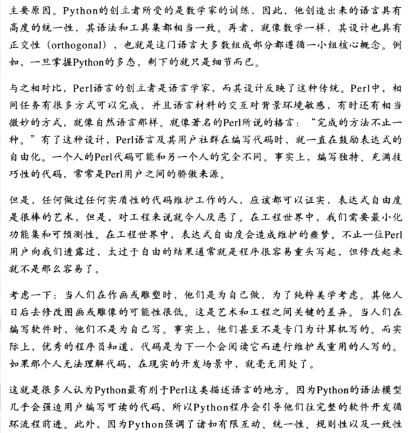
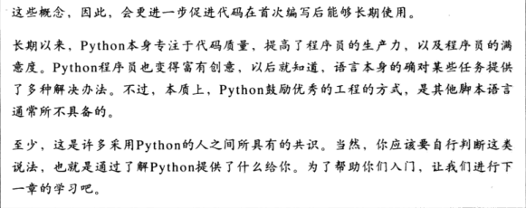

# 人们为什么使用Python
* 代码质量：Python的独有的一致性编码格式会增强代码的可读性，可维护性，可扩展性。同时也支持软件开发的高级重用机制，如OOP。
* 提高开发者的效率：Python的一行代码等价于Java的1/3，并且由于它是解释型语言，调试过程更加简洁。
* 程序的可移植性：这不紧体现在操作系统的跨平台上，还体现在其它(数据库操作)子程序。
* 标准库的支持：内置了很多常用的标准库，同时对第三方库也可以很好的支持。
* 组件集成：可以很好的与软件的其他部分集成，它们可以使用Java或其它语言编写的。
* 享受编程的乐趣
# 软件质量
这体现在它一致性的代码风格(在Python中，语法及风格，风格及语法)

Python推崇"明了胜于晦涩，简单胜于复杂"

> 可以在Python命令行中输入import this来查看Python中隐藏的彩蛋功能(Python的设计哲学)
> 

模块化和OOP

# 开发效率

# Python是脚本语言吗？
Python是一种面向对象的脚本语言，它既可以完成诸如命令行命令的微小功能，也可以完成企业级的应用开发。
在书中，我们把简单的代码称之为脚本，把复杂的多文件应用称之为程序

# Python的缺点是什么呢？
> 执行速度不够快
由于Python和Java一样，为实现程序的跨平台性，将代码解释为字节码而不是系统可以直接执行的二进制文件，所以这会在代码执行时损失一部分性能。

Python在其语言内部进行了优化，在某些情况下，它可以执行的像C一样快

在Python自身快捷的开发效率和当前计算机底层性能的支持下使得执行速度不再那么重要

如果速度确实很重要，那么可以把这部分分离出来，然后用Python脚本连接起来
> NumPy就是这样的一个例子，它使用双语言混编策略，对Python的数值计算进行扩展
# 使用Python可以做什么
|应用领域|组件支持|
|---|---|
|系统编程|针对操作系统的内置接口| 
|用户图形界面|TKinter,wxPython,PythonCard,Dabo等|
|Internet脚本|Django，TurboGears，Web2py，Pylons，Zope，WebWare|
|组件集成|JPython，Excel和Word脚本处理|
|数据库编程|pickle ZODB SQLObject|
|快速原型||
|数值计算和科学计算|NumPy SciPy|
|游戏|pygame|
|串口通讯|PySerial|
|图像处理|PIL，PyOpenGL，Blender，Maya|
|机器人编程|PyRo|
|xml解析|xml库，xmlrpclib|
|AI编程|神经网络仿真器|
|自然语言分析|NLTK|
可以在这个网站[https://pypi.org/](https://pypi.org/)搜索相应领域的更多支持

以上大多数领域中Python扮演的都是组件集成的角色，使用C或其它语言作为库组件的编写，增加Python到前端。

# Python技术上的优势
* 面向对象

    除了支持面向对象语言的高级特性如：多态，操作符重载，多重继承外，他还支持为其它的面向对象语言(Java)进行子类的定制，这再次体现出它在组成集成方面的优势
* 免费

    不只是免费，Python是社区驱动的，并且是开源的，只要可以，任何人都可以对语言自身做出自己想要的更改，并且这些更改有一套规范的约束和规范的测试系统，使得其在持续发展的同时还可以保持稳健

* 可移植性

    Python的标准实现使用ANSI C 编写的，可以再当前流行的平台上运行：
    * Linux和Unix
    * Windows/DOS
    * Mac OS
    * BeOS,OS/2,VMS,QNX
    * 实时操作系统：VxWorks
    * Cray超级计算机和IBM大型机
    * 运行Palm OS，PocketPC和Linux的PAD
    * 运行Windows Mobile和Symbian OS的移动电话
    * 游戏终端和iPod
    Python自带的标准库和模块也尽可能的在考虑跨平台，它使用字节码使其可以运行在所有系统上，大多数的外围接口也都有平台相关的扩展，例如tkinter的Tk GUI几乎可以在任何GUI平台上运行，无需做任何修改

* 功能强大

    它介于脚本语言和系统语言之间，不仅提供了脚本语言拥有的简单和易用性，还具有高级软件工程工具。
    * 动态类型
    > 不用像Java一样进行类型生命，运行期间推断类型。是一种广义上的对象
    * 自动内存管理
    > 自动分配，扩展，回收内存
    * 大型程序支持
    > 模块，类，异常，OOP等工具可以将程序组织成更大规模的系统
    * 内置对象类型
    > 内置了功能完备的常用类型(数据结构):列表，字典，字符串
    * 内置工具
    > 内置了对以上数据类型的常用操作如合并，分片，排序，映射等
    * 库工具
    > 预置了许多预编译的库工具，从正则到网络都支持
    * 第三方工具

    除了这一系列工具外，它还保持了相当简洁的语法和设计，综合上面的一切这就是一个具有脚本语言所有可用性的强大编程工具

* 可混合

    可与其它语言混合使用，例如：使用JPython和Java混合使用

* 简单易用

    简单的运行环境，不需要像其它语言一样需要编译或链接

    语法简洁和强大的内置工具，使其可以用少量的简单的代码去实现其它语言(Java)相同的功能，并且更加灵活

* 简单易学

# Python和其它语言的比较

比Tcl强大
比Perl简洁
比Java，C++简单，更易于使用
比VB更具跨平台性
比PHP应用广泛
比Ruby更成熟，语法更具可读性
具有SmallTalk和Lisp等动态类型的特性，但比它们更加简单

> Python是工程不是艺术
> 
> 它对比了Perl语言；Perl语言提倡完成的方法不止一种，所以这在后期维护或扩展时可能会成为开发人员的噩梦，虽然这使得程序员可以享受极大的自由度，创造出属于自己风格的代码；这在艺术领域是极好的，但是在艺术中，对一件艺术品的修改是很少发生的，恰恰相反，在工程中它是经常发生的。所以Python提倡开发者写出一致风格的代码，它的语法模型也是强制用户这么去做的，这使得代码更具有可读性从而改善代码的维护性。
> 
> 以下是原文的概述
> 
> 
