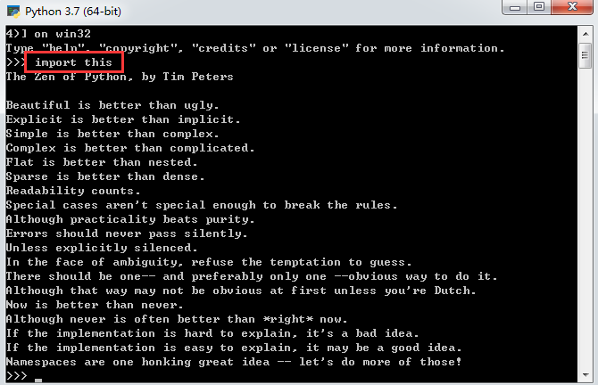

# 人们为什么使用Python
* 代码质量：Python的独有的一致性编码格式会增强代码的可读性，可维护性，可扩展性。同时也支持软件开发的高级重用机制，如OOP。
* 提高开发者的效率：Python的一行代码等价于Java的1/3，并且由于它是解释型语言，调试过程更加简洁。
* 程序的可移植性：这不紧体现在操作系统的跨平台上，还体现在其它(数据库操作)子程序。
* 标准库的支持：内置了很多常用的标准库，同时对第三方库也可以很好的支持。
* 组件集成：可以很好的与软件的其他部分集成，它们可以使用Java或其它语言编写的。
* 享受编程的乐趣
# 软件质量
这体现在它一致性的代码风格(在Python中，语法及风格，风格及语法)

Python推崇"明了胜于晦涩，简单胜于复杂"

> 可以在Python命令行中输入import this来查看Python中隐藏的彩蛋功能
> 

模块化和OOP

# 开发效率

# Python是脚本语言吗？
Python是一种面向对象的脚本语言，它既可以完成诸如命令行命令的微小功能，也可以完成企业级的应用开发。
在书中，我们把简单的代码称之为脚本，把复杂的多文件应用称之为程序

# Python的缺点是什么呢？
> 执行速度不够快
由于Python和Java一样，为实现程序的跨平台性，将代码解释为字节码而不是系统可以直接执行的二进制文件，所以这会在代码执行时损失一部分性能。

Python在其语言内部进行了优化，在某些情况下，它可以执行的像C一样快

Python自身开发效率的快捷在当前计算机底层性能的支持下使得执行速度不再那么重要

如果速度确实很重要，那么可以把这部分分离出来，然后用Python脚本连接起来
> NumPy就是这样的一个例子，它使用双语言混编策略，对Python的数值计算进行扩展
