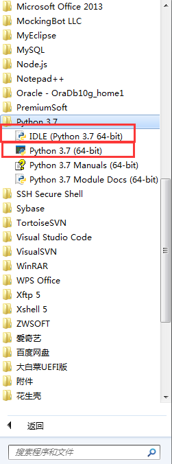
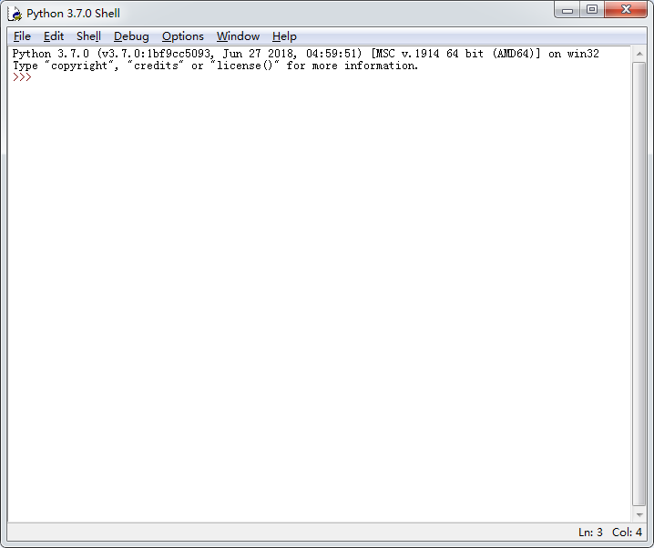
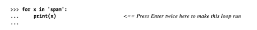

# 交互提示模式下编写代码

最简单的运行Python的方式就是在Python交互命令行中输入这些程序，可以在系统终端，IDE中打开命令行。你只需要在命令行中输入Python命令：

* 在Windows中，你可以在DOS终端窗口中输入或者在运行的对话框(WIN+R组合键打开)中
* 在Unix，Linux，MAC OS中，你可以在shell窗口或终端窗口中
* 在其他的平台或系统你可以使用特定于平台的方式

> 注意:如果你没有在系统环境变量中设置Python的安装目录，那么你需要在Python命令前加上其完整路径，或者将系统位置定位到Python的安装目录下。

> 在Windows中，你也可以通过启动程序目录中的IDLE主窗口或者打开Python程序的方式打开交互模式<br/>
> 

## 交互地运行代码

通过上面的方式打开交互模式后，会出现像下图这样的窗口(以下是在Windows中启动IDLE主窗口的方式打开的)：


你可以在">>>"后面编写Python语句，它会在你敲打回车键之后立即执行并在下一行打印出执行结果。

> 在命令行模式中，它会自动打印输入表达式的结果，因此你不必刻意的去输入**print**打印结果

> 输入多行表达式时，通过敲打两次回车键后执行结果，稍后会讲到

在这之后，在Unix系统中你可以通过键入Ctrl+D组合键来退出命令行或者在MS-DOS，Windows中键入Ctrl+Z，在IDLE窗口中你可以键入Ctrl+D或关闭窗口退出

> 注意：Windows命令行中Ctrl+Z亲测不能使用，可以选择关闭对话框或使用exit()函数退出

## 为什么使用交互提示模式

* 实验：由于它是立即执行的，所以当你看到不理解的语句时，可以直接在交互模式下输入语句来查看结果，这是搞清楚一段代码究竟做什么的最快的方式
* 测试：可以通过导入模块来快速测试模块的正确性，也可输入命令来连接C函数，java类等

## 使用交互提示模式
下面是使用过程中注意的一些细节：
* 只能够输入Python命令
* 在py文件中，只有输入**print**后才会打印结果，在交互提示模式下可以不输入
* 语句开头不要出现缩进字符。这在单个简单语句中适用，如果是多行复合语句，则需要缩进保持语法正确性
* 留意提示符的变化，正常情况下提示符是>>>，在多行复合语句中，它会是...或者缩进行。
    > Ctrl+C组合键可以返回主提示模式
* 用空行结束复合语句，单个简单语句回车就可以执行，复合语句则需要两次回车至出现一个空行才可以执行
* 一次只能执行一条语句

### 输入多行语句
以下是运行多行语句的示例，可以看到行首是以...开头，并且以空行结尾


这里需要注意的是，空行结尾只有在交互提示模式下是必须的，在编写脚本时，空行将会被省略，另外交互提示模式下一次只能运行一条语句，所以在复制粘贴代码时要注意不能粘贴多行代码，除非这些代码的每条复合语句后面都有空行。多行代码一般是写在一个文件中。

# 系统命令行和文件

尽管交互式命令行对于**实验和测试**来说都很好，但是它有一个很大的缺点：**执行之后就消失了**。复制粘贴也只能起到一点微弱的作用，特别是在稍大的程序中，它需要我们清理提示符，输出和其它的东西，这不是一种现代的软件开发方法。

为了使程序可以永久保存，我们需要在文件中写入代码；这样的文件我们成为**模块**。模块是一个包含了Python语句的**简单文本文件**。Python解释器可以多次运行这样的文件，你可以通过系统命令行，点击图标，IDLE等多种方式去运行它，它每次运行时都会从头至尾的执行模块文件中的每一条代码。

> **模块文件**这个术语可能在某些地方会有不同。一般来说包含一系列Python语句的可执行程序文件我们称之为**模块文件**。但是有时我们将可直接运行的模块文件称为**脚本**。也有人将被其它的文件引入的文件称为**模块**。

下面几部分内容，我们将介绍如何运行模块文件。首先我们来看一个简单粗糙但实用的方法：在系统提示模式下运行：

```
> python 模块文件名.py
```

## 第一段脚本

让我们打开任意文本编辑器，输入一下代码，并将其保存为[script1.py](code/03/script1.py)
```python
# 导入python模块，以获取系统平台名称
# #号之后为注释内容，不会被当做语句去执行，它可以使单独一行也可以在语句后
import sys
# 调用print函数，显示脚本的结果
# 当前平台的名称
print(sys.platform)
# 2的100次方
print(2 ** 100)
# 声明一个变量，在创建时为其赋值，保存一个字符串变量
x = 'spam!'
# 字符串重复
print(x * 8)
```

> 对于**顶层文件**而言，我们可以称它为**脚本**。

> 这里文件的.py后缀不是必须的，但是导入的模块文件必须是.py结尾的；而且.py后缀的文件会被文本编辑器识别从而帮助我们更好的编程，它会提供语法高亮和自动缩进等功能。

## 使用命令行运行文件
我们可以通过输入以下命令在模块文件所在的位置运行python命令，以下是命令和其输出

```
D:\github\book-notes\Python学习手册\code>python script1.py
win32
1267650600228229401496703205376
spam!spam!spam!spam!spam!spam!spam!spam!
```
我们也可以将语句保存在[非.py后缀文件](code/03/script1.txt)中；运行结果同上
```
D:\github\book-notes\Python学习手册\code>python script1.txt
win32
1267650600228229401496703205376
spam!spam!spam!spam!spam!spam!spam!spam!
```
> 如果你没有将python设置到环境变量中，那么我们需要用完整的目录路径去替换python命令

> 如果模块文件不在当前执行目录中，则需要给出模块文件的完整路径

由于这种方法是使用shell命令进行启动，所以常见的shell语法在这也适用；如下我们使用**流重定向**，将输出输出到[文件](/code/03/script1_output.txt)中。

```
D:\github\book-notes\Python学习手册\code>python script1.py > script1_output.txt
```

在最新的window平台中，由于系统本身会在注册表中查找执行文件的程序，所以我们可以省略掉python命令;此时我们必须指定文件后缀名为.py(windows本身通过后缀名去匹配执行程序)：

```
D:\github\book-notes\Python学习手册\code>script1.py
win32
1267650600228229401496703205376
spam!spam!spam!spam!spam!spam!spam!spam!
```

## 使用命令行和文件

在使用命令行运行文件时，需要注意一下几点陷阱：

* 注意windows上的文件扩展名；当系统隐藏扩展名时，我们需要更加小心；word文件会增加Python中不合法的格式字符。我们可以选择使用更加友好的文本编辑器，比如IDLE，它不会添加文件后缀。

* 在系统提示模式下需要指定模块文件的完整文件名，而在导入时只需要模块名；这是因为在系统提示下，使用的是系统的文件搜索规则，而在导入时，使用的是Python的模块文件搜索规则。

* 在文件中使用print语句(函数);在交互模式下，Python会自动响应表达式的结果，在这里不会。

## UNIX可执行脚本(#!)

我们可以在liunx这样的类UNIX系统上编写Python的可执行脚本；它们和windows上的文本文件的编写方式相同，但是有两个特殊的属性

1. 首行以#!开始，后跟Python解释器的路径
2. 需要将文件权限设置为可执行文件；可以使用chmod +x 文件名方式设置

> 这这里，顶层文件可以不用指定.py后缀名

编写完毕后，我们可以直接指定文件名去运行它；比如我们新建了一个名为brian的Python文件

```
#!/usr/local/bin/python
print('hello world')
```

我们可以直接使用下列的命令运行它

```
% brian
```
> 注意，当文件不在环境变量中时，应指定文件的完整路径

我们可以使用这种方式在类NUIX系统上运行它，但一般情况下为了平台的通用性，我们使用**python 文件名**这样的方式运行它会使我们的生活变得简单，此时，我们无需指定行首也无需去指定文件的可执行权限

我们也可以使用类UNIX的env去查找python解释器的位置，比如
```
#!/usr/bin/env python
# Python代码
```
此时env程序会自动去查找Python解释器的位置，无需我们硬编码去指定它；这可以在类UNIX系统上获得较高的通用性，但是这需要env程序在我们指定的路径下。

> env程序会在环境变量下去寻找Python解释器，所以这需要你将Python解释器添加到环境变量中

# 点击文件图标

在windows系统中，注册表可以帮助我们实现双击Python模块文件文件就可以运行一个Python程序；注册表会自动查找运行该文件的程序。

在其他系统中，我们也可以通过如关联文件的MIME类型这样的方式实现这一点，具体可以参考各个系统文件管理器的文档

## 在Windows中点击图标

还是以上面的[script1.py](code/03/script1.py)为例，我们打开我的电脑，点击定位到文件的位置，然后鼠标双击就可以了。

通常我们会双击.py文件，这是**源码文件**，这会使我们得到修改后的最新结果，我们也可以点击.pyc文件，这是**字节码文件**

## input的技巧

我们通过双击可以看到，屏幕总是一闪而过，这是一个正确的结果，程序会打开一个dos终端窗口运行，运行完了之后关闭它；但是这显然不是我们想要的结果。

我们可以通过在脚本最后添加input(Python2.6中为raw_input)内置函数让它在运行完程序之后"暂停"一下,如下：
```python
import sys
print(sys.platform)
print(2 ** 100)
x = 'spam!'
print(x * 8)
input()
```
这是因为input函数实际上是读取标准输入流的函数，在这里当你没有输入任何内容时，它会等待直至你输入内容并敲下回车或者直接敲回车为止，感觉上像是程序"暂停"了一样

> 在python中，有.pyw后缀的文件，这是python中的图形化文件，它不会以打开dos窗口的方式去运行程序，而是打开.pyw所产生的图形化窗口

这个技巧只有当在windows中，程序输出即退出，点击图标运行这三个条件全部满足时才使用；请注意，input函数的实际含义是接受用户的输入。

我们也可以这样使用input函数：

* 键入提示语句：input('请按下Enter键退出')
* 接受输入的内容：inputStr = input();
* shell时，像前面的输出重定向一样，可以使用输入重定向：python spam.py < input.txt

在后面章节中，我们会更详细的介绍input的用法

> 版本差异
> 
> 注意在Python2.6中，等价函数为raw_input函数，2.6中也有input函数，但它会将输入当做表达式去求值，然后将求值的结果返回给接受变量；在python3.0中我们可以使用eval(input())实现这一点，eval函数会去执行某一段字符。

## 图标点击的其它限制

即使我们使用了input函数，在程序执行发生错误时依旧会退出窗口，这是因为程序在错误处已经终止。我们在后面学习到try语句时可以找到修复这个问题的方法；但是目前为止我们应把点击图标启动的这种方式当做是一种便捷的启动方式而不是常规的启动方式，除非你可以确定程序不会发生任何错误或者已经将输出重定向到另一个文件中。

# 模块导入和重载

模块导入也是一种启动程序的方法，后面我们会学习模块的更深入的知识，这里将只介绍一些基础知识。

简单来说：每一个以.py扩展名结尾的Python源代码文件都是一个模块。其它的模块可以通过导入一个模块来读取这个模块的内容。从本质上来说，它就是载入另一个文件。一个模块的内容可以通过"属性"被外部使用。

这种基于模块的方式使模块成为Python程序架构的一个核心概念。更大的程序往往是以多个模块的方式展现，模块间由导入作为桥接，其中会有一个顶层文件(主文件)作为整个项目的入口启动整个项目。

在这里我们只关心导入操作最终可执行代码。让我们先打开一个交互对话框(这里将交互对话框模拟成顶层文件)；还是使用我们第一次编写的那个程序

```
>>> import script1
win32
1267650600228229401496703205376
spam!spam!spam!spam!spam!spam!spam!spam!
```
当我们导入那个文件时(注意没有.py后缀)，可以看到同上面相同的输出。但是这只在第一次导入有效，当我们再次导入时它不会触发任何操作，这是有意而为之的，因为导入的开销特别大，它经过查找编译执行这些步骤，因此每个模块至多只能导入一次。

如果我们想再同意会话中再次运行这个模块文件，我们可以使用imp标准库中的reload函数，首先我们需要导入这个函数，通过下面的方法我们可以直接导出模块中的方法
```
from imp import reload
```
然后我们在reload函数中指定我们要重载的模块名
```
>>> reload(script1)
win32
1267650600228229401496703205376
spam!spam!spam!spam!spam!spam!spam!spam!
<module 'script1' from 'D:\\github\\book-notes\\Python学习手册\\code\\03\\script1.py'>
```
以上输出中，最后一行是reload函数返回值的打印，它是一个**Python模块对象**

这可以让我们运行代码的最新版本，比如我们在另一个窗口中改变了script1文件之后，通过reload函数我们可以查看最新版本的执行结果。

reload函数的参数是一个已被导入的模块名称，所以我们需要确定这个模块已经被正确导入

> 函数(reload)调用需要括号，语句不需要(import)

> 版本差异
> 
> Python3.0中，将reload函数从内置函数转移到了imp标准库中，因此我们必须显示导入它才能使用，不同以上所介绍的，我们也可以通过导入imp模块(import imp)，然后通过模块变量去调用reload函数(imp.reload(script1)).
>
>Python2.6(2.X)中，我们可以直接作为内置函数来使用它或者为了方便向3.0迁移，我们也可以将它作为模块函数来使用。[(未做实验)在2.X中，用from载入的名字不会被reload重载，但import会，所以如果我们的模块名称不会在重载后发生改变，我们可以尝试使用import的方式]

## 模块的显要特性：属性

导入和重载提供了一种程序启动的选择。从更宏观的角度来看，模块扮演了一个工具库的角色。从一般意义上来说，模块就是变量名的封装，被认为是命名空间。

典型应用中，导入者可得到模块文件在顶层所定义的所有变量名，这些变量名通常代表了函数，类，变量或其它希望被导出的工具，它们往往会在其它文件中使用。

我们有俩种方式获取这些变量名

1. 通过import语句，我们导出整个模块，然后在模块变量名通过点号表达式去引用模块中的变量
2. 我们通过from语句，直接从模块文件中获得变量

无论我们通过哪种方式去导入，他都会在第一次导入时运行该模块

### dir函数

dir函数接受一个模块名变量，它会打印出这个模块所有的变量列表，其中包括内置变量(类似于这种的：__a__)

### 模块与命名空间

模块导入可以运行代码，同时模块也是Python中最大的程序结构。一般来说，一个模块就是一个独立完备的变量包，即命名空间，独立的模块之间不能看到其他模块定义的变量，除非它们有导入关系，这在很大程度上减少了变量命名冲突的问题。我们会在后面讨论其他的命名空间结构，在这里还是把它当做运行代码的一种方式

> 在使用from时，我们可能会将变量直接指引到导入文件中，这会导致变量冲突，所以，这也是很多人建议使用import而不是from的原因。但是from有它自身的优势(相较于import，它可以写更少的代码)，而且这种问题是可控的，它甚至很少会在实际应用中出现。

## import和reload的注意事项

首先你要确定模块是何时导入的才能在适宜的时机去重载模块

其次重载时，它只会重载你指定的模块，不会重载指定模块中导入的模块，此时你必须去重载多个模块  

当模块文件不在工作目录下时，在重载时，你需要去指定**PYTHONPATH环境变量**的值，这会导致额外的复杂性，因此现在在编写模块时，最好都写在一个工作目录下

# 使用exec运行模块文件

可以使用以下命令运行模块文件：
```python
>>> exec(open('模块完整路径名.py').read())
```
这会在每一次调用时运行最新的程序代码

它首先通过open函数打开模块文件并通过read将程序通过字符串的形式读取进来，之后exec运行这段字符程序

它本质上相当于将代码复制粘贴到这个地方，因此会发生变量名覆盖的问题
    
> 版本差异
> 
> 在2.6中，我们可以使用exec(open('模块完整路径名.py'))或execfile('模块完整路径名.py')内置函数去完成相同的工作，
>
> 这俩种简洁的形式在3.0中已经废弃了，由于这种方式需要我们键入太多的代码，所以一般情况下，我们建议使用shell命令行或使用下一节所介绍的IDLE

# IDLE用户界面

IDLE是一款为Python开发所诞生的可视化的开发工具，它是一个集编辑，运行，浏览，调试为一体的IED(集成开发环境),他是使用Python的TKinter GUI工具包开发的GUI程序，所以可以在几乎任何Python平台上运行，

## IDLE基础

在windows中，可以在开始菜单中找到IDLE点击它启动IDLE，也可以右击Python文件选择IDLE启动它；由于IDLE也是通过Python编写的，所以在其它系统中，可以选择启动Python的home目录下的Lib/idlelib/idle.py或者Lib/idlelib/idle.pyw模块文件启动IDLE；由于IDLE是使用TKinter工具包编写的，所以首先需要确保你的电脑中已经安装了该程序包。

打开之后所展示的首页是IDLE的shell主窗口，在这里，你可以像是在交互提示符下工作。

也可以选择新建(打开)Python**源文件**，这在IDLE的File下拉菜单里。

> IDLE中，不管是shell主窗口还是源文件中，代码都会高亮显示

编写完成后，你可能想要运行你的代码，此时在IDLE的Run下拉菜单下，选择Run Modules你就可以在shell主窗口下看到运行的结果；运行结果的首行可能会出现**RESTRAT:xxx**，这里它告诉我们用户脚本的进程重新启动以运行编辑的脚本，并且为独立的输出做好了准备(如果IDLE已经在没使用用户代码子进程的情况下启用，则不显示)

## 使用IDLE

IDLE是一款简单的Python IDE工具，它适合初学者去使用，相较于高级的IDE，它有一些局限需要我们注意：

* **保存文件时，需要明确的添加.py后缀**；虽然没有后缀也可以运行，但是当它作为模块被其它模块导入或在命令行启动时就会失败。

* **使用Run下拉菜单的Run Modules运行它**；相较于导入重载机制，它总是能够保证以简单的方式每次去运行最新的代码，而且它可以运行所有导入的模块最新的代码，包括被导入到顶层文件的模块。

* **可以对IDLE进行定制**；你可以设置自己的IDLE风格，通过Option下拉菜单的Configure IDLE选项。

* **在IDLE中没有清屏操作**；你可以一直按回车键模拟清屏，这可能会在后续的IDLE版本中加上

* **IDLE不适于运行Tkinter和线程程序**；这已经在最新的IDLE中进行了改良，但仍然会出现无响应情况，如果出现这种情况，可以在IDLE中编写完代码后，选择其它方式启动它

* **如果发生了连接错误，尝试以单线程模式启动IDLE**；由于IDLE要求在其独立的用户和GUI进程间通信，有时他会在特定的平台上发生启动错误。使用-n选项，例如**idle.py -n** 

* **谨慎使用IDLE一些可用的特性**；IDLE可以让工作变得更容易，有些技巧可以方便我们的开发，但它只是IDLE特性，这在其它环境中可能会出现问题。比如IDLE自动将你的工作目录设置为模块搜索目录，在其它环境则需要你手动设置。

## 高级IDLE工具

除了编辑运行这样的基础功能外，IDLE还支持一些高级的功能，比如：

* **对象浏览器**；通过File下拉菜单中的Module Browser选项打开；它可以查看搜索路径下的文件及文件中的对象

* **Debug**；通过打开主shell窗口中Debug下来菜单中的Debuger选项打开Debug模式，之后运行你的**源文件**就可以在Debuger窗口中调试你的代码。你可以在源文件的某行上右击设置/取消断点，当断点执行到当前时，可以查看变量值，执行结果

* **快速定位错误行**；通过在错误信息上右击，可以快速定位到发生错误的位置

* 除了上面这些以外，IDLE还提供了其它丰富友好的工具集，比如：**自动缩进**，**高级文本**和**文件搜索**等，可以实践去感受它们


