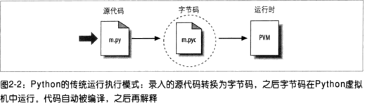

#  Python解释器简介

Python不仅仅是一门编程语言，它也可以是一个**解释器**的应用程序用来运行Python程序。**解释器**是代码与机器的计算机硬件之间的软件逻辑层。

当在电脑上安装Python之后，它会包含最小化的组件：解释器和支持的库。根据使用情况的不同，解释器可能采用可执行程序的程序或者链接到另一个程序的一系列库。根据Python版本的不同，解释器可能是C程序实现，或一组Java类，或是其它。无论解释器的形式种类如何，Python代码必须在解释器中运行。

# 程序执行

* 程序员的视角

    就最简单的形式而言，一个Python程序就是一个包含Python语句的文本文件，它通常是以.py结尾，从技术上讲，这种命名只有在被"导入"时才是必须的；但是为了统一起见，绝大多数的Python文件都是以.py结尾。之后可以通过命令行或者在IDE中运行Python程序，它会按照从头至尾的顺序执行文件中的语句。

* Python的视角

    Python是按照这种顺序运行的：先将源代码转换为字节码，然后将字节码运行在PVM中，如图：
    

    * 字节码编译

        当程序执行时，Python内部会先将源代码编译成字节码(指令)的形式，这一切对于用户来说都是无感知的。编译是一个简单的翻译过程，字节码是与底层硬件平台无关的，它直接运行在PVM上。这些字节码指令的执行速度要比源代码的执行速度多得多。

        字节码文件是以.pyc后缀名结尾的如果,Python进程对机器有写入的权限，那么它会将字节码文件保存在与源代码同一目录下的位置；如果对机器没有写入的权限的话，那么它会保存在内存中并在程序执行完之后就丢弃。

        > 严格来说，字节码只有在文件导入时才会保存，并不是对顶层文件，交互模式下不会有字节码文件生成

        Python保存字节码的方式可以作为一种启动速度的优化。当源代码没有更改时(Python会对比字节码文件和源代码文件的时间戳)，它会直接执行字节码文件，当改变时会重新编译。由于有这个优化，所以通常建议将Python的写权限打开。

        Python执行的是字节码(.pyc)文件，所以当你只有字节码文件时，程序也是可以照常执行的

    * Python虚拟机(PVM)

        Python将代码编译成字节码指令后，它会将这些指令发送至PVM中，PVM负责执行。

        PVM就是迭代运行字节码指定的一个大循环，他是**解释器**的最后一步。

    * 性能的含义

        由于Python是运行在PVM中并且运行的是字节码指令而不是底层的机器码，所以它的执行速度是慢于C的，但是Python的解释器会对字节码进行一些优化，这使得它的执行速度位于传统的解释型语言和编译型语言之间
    
    * 开发的含义

         1 Python的开发环境和执行环境没有区别

         2 Python没有预编译和链接阶段，开发速度会有提升

         3 Python可通过evel和exec模块在代码运行期间再次运行Python代码

         4 Python只有运行时，它会带来更加动态的编程体验

* 执行模块的变体

    以上的内部执行流程的都是Python的标准实现，实际上这些并不是Python语言所必须的。正因为这点，执行模块也是随时间而演变的。有些系统已经改进的上图所示的执行流程。

    * Python实现的替代者

        * CPython

        标准的Python实现，以上所讲的就是CPython

        * Jython
        
        是为了与Java语言集成而编写的，Jython中包含一组Java类，这些类将Python源代码编译为java字节码，并将其运行在JVM中。在开发时，还是使用Python语言的语法去开发。

        它同标准的Python一样：先将源代码转换为JAVA字节码，然后将字节码运行在JVM中

        * IronPython

        .Net的Python集成方案

    * 执行器优化工具

        * Psyco实时编译器

            它在运行时会将字节码进一步编译为机器码从而提高运行速度

        * Shedskin C++转换器

            它将Python代码转换为C++代码，然后编译为机器码。但是它会产生C++的静态类型约束
        
    * 冻结二进制文件

        可以通过网络上的工具将Python打包为.exe或其他平台的可执行二进制程序，比如：py2exe,PyInstaller

        冻结二进制文件通常将Python程序的字节码，PVM和其它所需要的支持文件打在一个包内。

