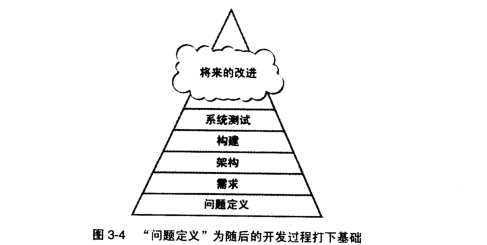
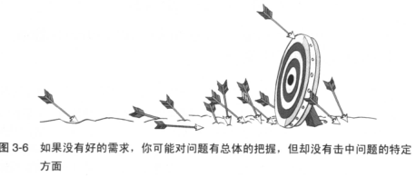
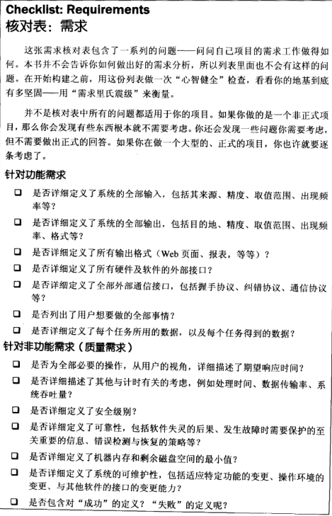
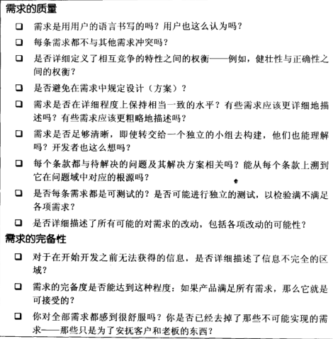
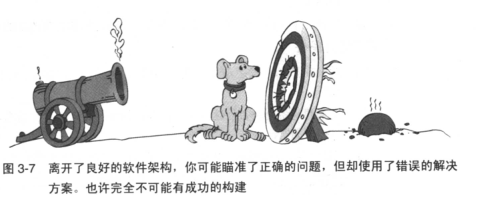
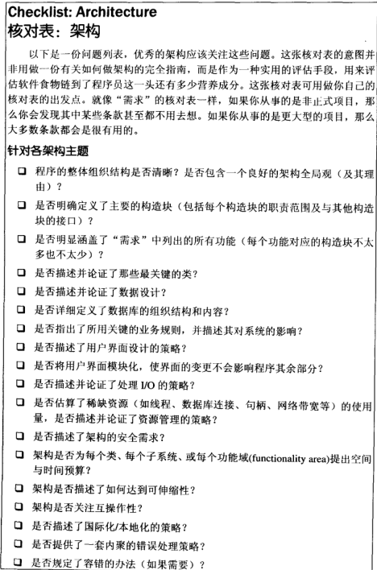
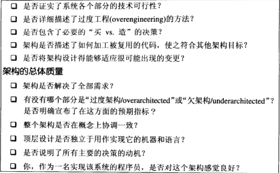

在开始建造房子之前，施工人员会审视蓝图，查看是否获得了全部许可证，并测量房屋的地基；软件构建也是一样，项目的成败在构建活动之前就已经注定了。

构建活动占整个项目成本的60%；糟糕的软件项目最终会进行俩三次(甚至更多)构建。
# 1. 前期准备的重要性
使用高质量的实践方法是创造创建高质量软件的方式；这些高质量的实践方法在项目的初期，中期，末期都强调高质量。

> 关注质量就是提高生产力的最佳途径

如果是在末期强调质量，那么我们就会强调系统测试；但是测试只是完整的质量保证策略的一部分，而且不是最有影响的部分。测试是不能检查出前期产品设计或者构建过程中的错误。

如果是在中期强调质量，那么我们就会强调构建实践。

如果是在初期强调质量，那么我们就会计划，要求并且设计一个高质量的产品。如果我们用奇瑞的设计来开始生产过程，无论如何努力，它也绝对不会变成劳斯莱斯。

可以看到，构建活动是软件项目的中期阶段，在我们已经开始构建的时候，项目的前期工作或多或少就已经为这个项目的成功或失败打下了基础。如果你已经看到了失败的乌云已经出现，就退回到前期准备工作吧。

接下来我们会指出为什么前期的准备工作很重要，并且会告诉你如何判定"是否已经准备好开始构建工作了"

## 前期准备适用于现代软件项目吗

> 如果在开始构建活动之前认真的进行适当的准备活动，那么项目会运转的极好

准备工作的中心目标是降低风险，一个好的项目规划者能够尽可能早地将主要的风险清除掉，以使项目的大部分工作都可以平稳的进行。由于最常见的风险是糟糕的需求分析和项目规划，因此准备工作就倾向于这两点。

构建活动的准备工作不是一门精准科学，它会随着项目的特点来选择特定的降低风险的方式，具体细节也会随项目的不同而变化较大。

## 准备不周全的诱因

* **做前期准备活动的人员不具备完成这一项任务的技能**。项目规划，需求分析等前期准备活动都需要一定的专业技能。如果不能把这件事情做好，那么做再多也没有意义
* **不能抵抗"尽快开始编码"的欲望**。切记：事先做好计划能避免很多压力。
* **管理者对前期准备活动不重视**。管理者对那些"花时间进行构建活动的前期准备的程序员"的冷漠已经到了人神共愤的程度。
> 如果你不幸遇到了这样的老板，那么你可以这样做：
> 1. 果断拒绝
> 2. 假装在写代码
> 3. 教育你的老板
> 4. 果断辞职

## 关于开始构建之前要坐前期准备的绝对有力且简明的证据
在实现一个系统之前，你需要理解**这个系统应该做什么**以及**它该如何做到这点**

**在开始编码，测试，调试之前进行需求分析和架构设计才能保证关键的方面都做对**这句话的根据在哪里呢，就让我们看看下面这些论据

* **诉诸逻辑**
    
    进行有效编程的要领之一是：准备工作很重要。大的项目开始之前需要大量的计划，而小的项目则可以少些。从管理的角度看，做计划就意味着确定项目所需要的时间，人数以及计算机台数；而从技术的角度看，做计划意味着弄清楚你想要建造的是什么。有时候用户一开始并不确定自己想要的是什么，因此需要花费比理想情况下更多的力气找出他们想要的东西，但是这总比**先做出一个错误的东西出来，然后扔掉从头来过**的成本要低廉的多。

    在做一个系统之前，先考虑如何去做也是非常重要的，我们都不希望花费大量的精力和金钱而走进死胡同。

* **诉诸类比**

    在建造一座房屋之前，我们需要在开始钉钉子之前准备好手绘草图(总体设计，架构设计)和蓝图(详细设计)。在浇筑混凝土之前也必须审核蓝图并获得批准。在软件领域做技术规划也包含同样多的事情。

    在把圣诞节立起来之前，你不会对它做装饰；在打开烟囱之前，你不会生活；在做软件时，你也必须按照正确的顺序去做

    如果把开发比作一条食物链，那么就是架构师吃掉需求，设计师迟到架构，而程序员则吃掉设计。程序员是处在食物链的最后一环。在健康的生态环境中，海鸥吃掉健康的鲑鱼，这对海鸥来说是营养丰富的大餐，隐喻鲑鱼吃掉的是新鲜的青鱼，而青鱼吃掉的是新鲜的水草；可以看出，如果每一层都是健康的食物，那么最终就能获得健康的代码。而如果青鱼吃掉的是在核废料的水里生长的水草，鲑鱼吃掉的是被污染的青鱼，而吃青鱼的鲑鱼还在充满原油的水里游荡，那么海鸥它吃下去的就不仅仅是原油，还有核废料等；在软件中也是一样，如果需求被污染了，那么它就会污染架构，架构最终会污染架构。

    如果是迭代项目的话，就像建造住宅小区一样，在建造第一栋房子之前，不需要知道房子的细节，但是却要制定下水道和电线的走向等，如果这些准备的不充足，那么很可能会出现像**需要在某所房子下面挖下水道**的问题；迭代软件时，我们也需要弄清楚那些是最关键的需求和架构要素，毕竟我们不想为了添加一个小功能而对架构进行大量的更改。

* **诉诸数据**

    > 发现错误的时间要尽可能接近引入该错误的时间，错误在软件食物链中待得时间越长，它对食物链的后级造成的损害就越严重。

    如下是"引入错误的时间和找到错误的时间"与"修复缺陷的费用"之间的关系；横轴表示检测到错误的时间

    |引入错误的时间|需求|架构|构建|系统测试|发布之后|
    |---|---|---|---|---|---|
    |需求|1|3|5-10|10|10-100|
    |架构|-|1|10|15|25-100|
    |构建|-|-|1|10|10-25|

# 2.辨明你所从事的软件的类型

软件开发中，有几百种编程语言，40种收集需求的方法，50种进行软件设计的方法，30种针对软件测试的方法；不同种类的软件项目，需要在"准备工作"和"构建活动"之间做出不同额平衡。

下表列出了三种最常见的软件项目列表，并且列出了各种项目最适合的典型实践，其中横轴是指软件种类：

||商业系统|使命攸关的系统|性命攸关的系统|
|---|---|---|---|
|典型应用|Internat站点 Intranet站点 库存管理 游戏 管理信息系统(MIS) 工资系统|嵌入式软件 游戏 Internet站点 盒装软件 软件工具 Web services|航空软件 嵌入式软件 医疗设备 操作系统 盒装软件|
|生命周期模型|敏捷开发(极限编程，Scrum，time-box开发等) 渐进原型(prototyping)|分阶段交付 渐进交付 螺旋型开发|分阶段交付 螺旋型开发 渐进交付|
|计划于管理|增量式项目计划 随需测试与QA计划 非正式的变更控制|基本的预先计划 基本的测试计划 随需QA计划 正式的变更控制|充分的预先计划 充分的测试计划 充分的QA计划 严格的变更控制|
|需求|非形式化的需求规格|半形式化的需求规格 随需的需求评审|形式化的需求规格 形式化的需求检查|
|设计|设计与编码是结合的|架构设计 非形式化的详细设计 随需的设计评审|架构设计 形式化的架构检查 形式化的详细设计 形式化的详细设计检查|
|构建|结对编程或独立编码 非正式的check-in手续或没有check-in手续|结对编程或独立编码 非正式的check-in手续 随需代码评审|结对编程或独立编码 正式的check-in手续 正式的代码检查|
|测试与QA|开发者测试自己的代码 测试先行开发 很少或没有测试(由单独的测试小组来做)|开发者测试自己的代码 测试先行开发 单独的测试小组|开发者测试自己的代码 测试先行开发 单独的测试小组 单独的QA小组|
|部署|非正式的部署过程|正式的部署过程|正式的部署过程|

在真实项目中，你会找到表中三种主调的无数种变种，以上只是列出了它们的共性；开发的商业系统的项目往往受益于高度迭代的开发法，**这种方法的"计划，需求，架构"活动与"构建，系统测试，质量保证"活动交织在一起**。性命攸关的系统往往采用更序列式的方法，**因为"需求稳定"是确保"超高等级的可靠性"的必备条件之一**。

## 迭代开发法对前期准备的影响
    
迭代方法往往能够减少"前期准备不足"所造成的负面影响，但是它不能完全消除此影响。

一般情况下，在"前期准备量"一定的时候，迭代开发的成本要比序列开发的成本低得多。但是**前期准备**依旧是最重要的环节;预先详细说明所有的需求和设计是不切实际的，**但还是应该尽早的把那些最关键的需求和架构要素确定下来**。以下是俩种比较好的经验：
1. 预先完成80%的前期准备，然后给剩下的20%添加说明并预留时间，在项目进行过程中，实施系统化的变更控制措施，只接受最有价值的新需求
2. 预先完成20%的前期准备，然后以小幅增量的方式完成剩余部分，随着项目的进行，对额外的需求和设计做出详细说明。

## 在序列式开发法和迭代式开发法之间做出选择

以下是选择序列化开发法的一些原因：

* 需求相对稳定
* 设计直接了当，而且理解透彻
* 开发团队对于这一业务领域非常熟悉
* 项目的风险很小
* "长期可预测性"很重要
* 后期改变需求，设计和编码的代价可能很昂贵

以下是你选择迭代式开发法的一些原因：

* 需求并没有被理解透彻，或者处于其它原因你认为他是不稳定的
* 设计很复杂，或者具有挑战性，或者两者兼具
* 开发团队对于这一业务领域不熟悉
* 项目存在很多风险
* "长期可预测性"不重要
* 后期改变需求，设计和编码的代价可能很低

在软件开发中，使用迭代式开发法的情况比适合序列式开发法的情况要多得多，你可以调整前期准备的完备情况和正式情况以适应开发方式。**大型项目和小型项目的开发方法也是不同的**

你应该首先确定哪些前期准备适用于你的项目，准备太少则可能会导致后期的会有更多的变动，准备太多则会导致做了太多无用工作(后期被证实无用的准备)而阻塞后期活动的进行。

接下来，我们看一下：如何判断每一项特定的前期准备工作是否到位

# 3.问题定义的先决条件

在开始构建之前，首先要满足的一项先决条件就是**对这个系统要解决的问题做出清楚的陈述**。问题定义也被称作**产品设想/product vision**，**设想陈述/vision statement**，**任务陈述/mission statement**或**产品定义/product definition**。这里我们称它为问**问题定义/problem definition**

**问题定义**只是**定义了问题是什么**，不涉及任何的解决方案。例如："我们跟不上Gigatron的订单了"这句话听起来像个问题，这就是一个很好的问题定义；"我们需要优化我们的系统，使我们跟上Gigatron的订单"这句话包含了解决方案，就是一个糟糕的问题定义。

问题定义应该用用户理解的语言去描述，应该从客户的角度来描述问题；通常不应该用计算机的专业术语描述(除非针对的客户是计算机相关的)，并且最终最好的解决方案不一定是一个计算机程序；有时候传统的解决方案要快速并灵活很多。

如果没有一个良好的问题定义，你努力解决的问题就可能是一个错误的问题。最终要解决的目标都是错的。如下图所示

"未能定义问题"的处罚是，你浪费了大量时间处理错误的问题，同时你也没有解决正确的问题。

问题定义在具体的需求分析工作之前，而需求是对问题定义的深入调查，如下图

# 4.需求的先决条件

**需求**详细描述软件系统应该做什么，这是达成解决方案的第一步。需求活动也被称为**需求开发/requirements development**，**需求分析/requirements analysis**，**分析/analysis**，**需求定义/requirements definition**，**软件需求/software requirements**，**规格书/specification**，**功能规格书/functional spec**，**规格/spec**。

## 为什么要有正式的需求

要求一套名曲的需求，这点很重要。理由很多，下面列出几点

* 明确的需求可以保证是用户(而不是程序员)驾驭系统。如果需求不明确，程序员就会常常在编码时自行决定需求。明确的需求免得你去猜测用户想要的是什么。
* 明确的需求有助于避免争论。如果你和另一个程序员去争执程序应该做什么，就可以查看书面的需求以解决分歧
* 明确的需求有助于减少编程开发之后的系统变更情况。需求阶段引入的错误在编码阶段进行更改代价是巨大的。
* 明确的需求是项目成功的关键，它有时甚至比有效的构建技术更为重要。

如果没有好的需求，你可能对问题有总体把握，但却没有击中问题的特定方面

## 稳定需求的神话

稳定的需求是软件开发的圣杯(圣杯一词暗指希望渺茫)，一旦需求稳定，项目就能以有序的，可预测的，平稳的方式完成架构到设计到编码到测试等一系列工作。

"一旦客户接受了一份需求文档，就再也不改变"是一个美好的愿望。实际上，在编写代码之前，客户是无法可靠的去描述他们想要的是什么。就和你做项目的时间越长就对项目越了解一样，客户也是随着项目的进行理解逐步深入。这往往是需求变更的主要来源。

不过我们可以采取一些步骤使需求变更的负面影响最小化

## 在构建期间处理需求变更

在构建期间，我们可以使用以下方式处理好构建期间的需求变更

* **使用下面的需求核对表来评估需求的质量**。如果需求不够友好，就停止工作，退回去，把它做好再继续前进。

* **确保每一个人都知道需求变更的代价**。对客户来说，要让他知道需求变更的代价，比如进度和成本等。

* **建立一套变更控制程序**。如果客户还是热情不减，那就考虑建立一个变更控制委员会，审批所有变更并在特定的时间处理这些变更。

* **使用能适应变更的开发方法**。可以考虑使用迭代开发法，增量开发

* **放弃这个项目**。这个需要谨慎的考虑。

* **注意项目的商业案例**。有时需求作为功能来讲是个不错的想法，但是可能在评估了"在商业上的价值"的时候，就会是一个很糟糕的主意。

# 5.架构的先决条件

**软件架构/software architecture 是软件设计的高层部分，是用于支撑更细节的设计的框架**。架构也被成为**系统架构/system architecture**，**高层设计/high-level design** 或**顶层设计/top-level design**。通常会有一份独立的文档描述架构，这份文档成为**架构规格书/architecture specification** 或者**顶层设计**。有人会对**架构**和**高层设计**加以区分：架构是指适用于整个系统范围的**设计约束**，高层设计是指适用于子系统层级或多个类的层次上的**设计约束**。

那么为什么要把架构纳入前期准备呢？因为架构的质量决定了系统的**概念完整性**，进而决定了系统最终的质量；一个经过慎重考虑的架构为"从顶层到底层维护系统的概念完整性"提供了必备的结构和体系，它为程序员提供了指引。它将工作分为好几个部分，使多个开发者和多个开发团队可以独立工作。

好的架构使构建活动变得更容易，糟糕的架构则使构建活动变得寸步难行。如下图所示，展示了糟糕的架构的另一个问题：

对架构的变更和对需求的变更所付出的代价是一样的

## 架构的组成部分

很多组成部分是优秀的系统架构所共有的，不管是你自己构建整个系统(这种情况下，架构的工作与详细设计的工作会有重合；你至少应该考虑架构的每个组成部分)还是接手别人架构的系统(这种情况下，你应该找出架构的部分)，你都应该考虑以下的架构组成部分：
* **程序组织**  

    系统架构首先要以概括的形式对有关关系做一个综述。

    > 如果你不能向6岁小孩解释某些事，那么你自己就没有真正的理解它。

    系统架构还应该记录那些曾经被考虑过得方案；维护设计的缘由与维护设计本身同等重要。

    系统架构还应该定义主要的构造块。它可能是一个子系统或者是单独的类。它们实现了一种高层功能，比如用户交互和数据局访问等。每条列在需求中的功能特性都应该至少有一个构造块覆盖它；如果是两个构造块描述同一功能，那它们就应该是相互配合的而不是相互冲突的。

    应该明确定义每个构造块的职责，每个构造块负责某一区域的事情，它们对其它区域了解的越少越好；这将增强系统的内聚性，从而更便于维护。

    应该明确定义构造块之间的通讯规则。对于每个构造块，应该描述它可以直接使用哪些构造块，能间接使用哪些构造块，不能使用哪些构造块。

* **主要的类**

    架构应该详细定义所用的主要的类。它应该描述类的主要职责，以及该类与其他类的交互方式。应该对类的集成体系，状态转换，对象持久化等进行描述。如果系统足够大，那他还应该描述如何将这些类组成一个个的子系统。

    这里同样也可以将曾经考虑过的类设计方案列出来，并给出为何选择当前方案的原因。不需要将所有类都列出来，我们可以将构成系统80%的20%的类列出来。

* **数据设计**

    架构应该描述所用到的文件和数据库表的设计，同样的，也应该描述曾经考虑过得设计方案并说明最终理由。

    数据通常只应该由一个类或一个子系统去访问，但这也有例外。

    架构应该详细定义所用数据库的高层组织结构和内容。架构应该解释为什么单个数据库比多个数据库好(或多个数据库比单个数据库好)，为什么不用文件而用数据库，与其它访问同一数据的交互方式，会创建哪些数据库视图等

* **业务规则**

    如果架构依赖于特定的业务规则，那么久应该描述这些规则，并且描述这些规则对系统设计的影响。

    举个例子：假如用户有这么一个规则"客户的信息过时时间不能超过30S"，架构就应该描述这条规则对架构采用的"保持客户信息及时更新且同步"的方法的影响。

* **用户界面设计**

    用户界面常常在需求阶段进行详细说明，如果没有，就应该在软件架构中进行详细说明。架构应该详细定义Web页面格式，GUI,命令行接口等主要元素。精心设计的用户界面架构决定了以后做出来的是人见人爱的程序还是没人爱用的程序。

    架构应该模块化，一遍替换用户界面时不影响业务规则及相关输出。
    
* **资源管理**

    架构应该描述一份管理稀缺资源的计划。稀缺资源包括数据库连接，线程，句柄等，在内存受限的领域，还包括内存。架构应该估算在正常情况下和极端情况下的资源使用量。如果需要系统主动的管理资源，那么还应该仔细设计"资源管理器"

* **安全性**

    架构应该描述实现设计层面和代码层面的安全性的方法。如果之前没有建立威胁模型，那么在架构阶段建立威胁模型。在制定编码规范时就应该把安全性考虑进去，包括处理缓冲区的方法，处理非受信数据的规则，加密，错误消息的细致程度，保护内存中的私密数据等等。

* **性能**

    如果需要关注性能，就应该在需求中详细定义性能目标。性能目标可以包括资源的使用，这时，性能目标也应该详细定义资源的优先顺序。

    架构应该提供估算的数据，并解释为什么要相信这些数据。如果有性能不达标的部分，也应该指出来。如果为了满足性能要求而使用算法或数据类型，架构也应该说清楚。架构中也可以包括各个类和各个对象的空间和时间预算。

* **可伸缩性**

    可伸缩性是指系统生长以满足未来需求的能力。架构应该去描述系统如何应对用户数量，服务器数量，网络节点数量，数据库记录数，数据库记录的长度，交易量等的增长。如果系统不会增长，而且伸缩性不是问题，则系统架构应该列出这一假设。

* **互用性**

    如果预计这个系统会与其它软件或硬件进行数据或资源共享，则架构应该描述如何完成这一任务

* **国际化/本地化**

    国际化是让程序支持多个地域，本地化是翻译一个程序使其支持当地特定的语言。

    对交互式项目，由于提示信息较多，所以应该在架构中关注国际化这个问题。架构应该估算这些字符所使用的资源，如果是一个商业使用的项目，则应该列出所选用的字符集和字符类型。如何维护这些字符，如果使这些字符适应国际化等，架构在描述解决方案的同时也应该描述为何选择这种方案。

* **输入/输出**

    输入/输出是架构中值得注意的另一个领域。架构应该详细定义读取策略是先做，后做还是即时做；还应该描述在哪一层检测IO错误：在字段，记录，流或者文件的层次。

* **错误处理**

    由于代码中存在大量的处理异常的代码，所以在架构中也应该清楚的说明一种"一致的处理错误"的策略

    错误处理常常被认为是"代码约定层次"的事情。但是由于它会牵连整个系统，所以最好在架构层次上对待它。下面是一些我们应该考虑的问题：
    * 错误处理是进行纠正还是仅仅只是检测它。
    * 错误检测是主动检测还是被动检测。 
    * 程序如何传播错误。
    * 错误消息的处理有什么约定？有没有定义一致的处理策略？
    * 如何处理异常？何处可以抛出异常？何处可以捕获异常？如何记录异常？如何描述异常？
    * 在程序的什么层次上处理错误？
    * 每个类在验证其输入数据的有效性方面需要负何种责任？是每个类负责校验自己的数据还是有负责整个系统数据有效性校验的一组类？某个层次的类是否可以假设数据是干净的？
    * 是希望使用语言或运行环境内置的错误处理机制还是建立一套自己的体制？

* **容错性**

    架构还应该详细定义所期望的容错种类。容错是增强系统可靠性的一组技术，包括检测错误，如果可能的话从错误中恢复，否则则包容其不利影响。

    比如计算某数的平方根，可以有以下几种容错策略：

    * 在检测到错误的时候回退回去再试一次。
    * 系统有一套辅助代码，以备主代码出错的时候使用。
    * 系统采用表决算法。在这个例子中，它提供三种计算平方根的算法，然后对比计算结果，最后根据系统的容错种类，返回三个结果的均值，中值或众值。
    * 系统会提供不会对系统其它部分产生危害的默认值替代错误的值

    其它容错方法包括在遇到问题的时候，使系统转入某种部分运转的状态，或者传入某种功能退化的状态。可参考其它资料了解更多的容错策略

* **架构的可行性**

    架构应该论证系统的技术可行性。如果在任何一个方面不可行都会导致项目无法实施，那架构就应该说名这些问题是经过研究的。必须在全面构建开始之前解决掉这些风险。

* **过度工程**

    健壮性是指**系统在检测到错误后运行的能力**，通常架构描述的系统要比需求描述的系统更健壮。在软件中，系统的健壮性不是取决于最弱的一环，而是等于所有薄弱环节的乘积。架构应该指出程序员应该"为了谨慎起见宁可进行过度工程"，还是做出简单的能工作的东西。

    通过在架构中明确的设立期望目标，可以避免程序员在编写代码时过度工程导致某些类异常健壮，某些类勉强健壮的问题。

* **关于"买"还是"造"的决策**

    在特定问题领域，可能已经存在了很多现成组件/程序库，如果架构决定重新实现它就应该说明"自己定制的组件应该在哪些方面胜过现有的组件/程序库"

* **关于复用的决策**

    如果开发计划计划使用现有的组件，那么架构应该说明如何对已有的组件进行加工使其符合其他架构目标(如果需要与其符合)。

* **变更策略**

    架构应该设计的足够灵活，使其能够适应可能出现的变化。

    架构应该清楚的描述处理变更的策略。列出已经考虑过有可能变化的功能，并添加说明。

    架构应该说明延迟提交(是指推迟某些因素的确定时间，做晚绑定以增强灵活性)所使用的策略

* **架构的总体质量**

    优秀的架构规格书的特点在于讨论了系统中的类，讨论了每个类背后的隐藏信息，讨论了"采纳或排斥所有可能的设计替代方案"的根本理由。

    它应该是带有少许附加物的精炼且完整的概念体系。

    每一项架构的变更都应该干净地融入整体概念

    它的目标应该清楚的表述

    它应该描述所有主要决策的动机

    优秀的软件架构不受机器和编程语言的影响；不要提前去做那些放到构建设计期间能做的更好的工作。如果程序是针对某种特定的机器或语言，那你就当做没看到这行

    它不应该**过度描述**也不应该**欠描述**，对待所有部分的描述都应该是公平的。

    它应该明确的指出有风险的区域，并说明为什么有风险，有哪些方法可以使风险最小化

    它应该包含多个视角。以帮助程序员完整的理解系统的设计

    最后你不应该担忧架构的任何部分。如果你自己都不懂它，那怎么去实现它？

    你可以参考下面的核对表来确定架构的质量
    
    

# 6.花费在前期准备上的时间长度