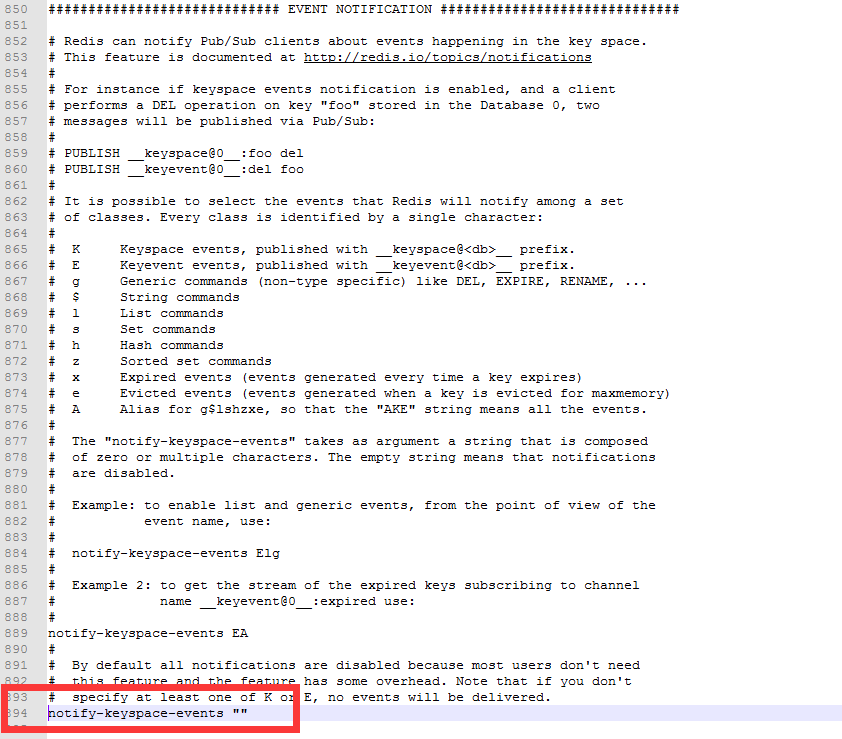

有时需要监听Redis的事件从而在Redis事件发生时添加一些后续操作；在实际开发过程中，有这么一个需求，监听Redis中的键状态，从而去更改程序中数据的状态；实现方法如下：

* **方法一**: 实现redis提供的MessageListener接口

    首先开启Redis的监听事件，大约在Redis配置文件的889行，或者直接搜索**notify-keyspace-events**，将其更改为你需要监听的类型
    
    > 这段注释已经写得非常清楚了，建议想了解配置详情的哥们可以把下面这部分注释复制粘贴到翻译软件中自己理解，如果急于功能实现的话，那么就把**notify-keyspace-events**属性设置为EA

    ```
    # Redis can notify Pub/Sub clients about events happening in the key space.
    # This feature is documented at http://redis.io/topics/notifications
    #
    # For instance if keyspace events notification is enabled, and a client
    # performs a DEL operation on key "foo" stored in the Database 0, two
    # messages will be published via Pub/Sub:
    #
    # PUBLISH __keyspace@0__:foo del
    # PUBLISH __keyevent@0__:del foo
    #
    # It is possible to select the events that Redis will notify among a set
    # of classes. Every class is identified by a single character:
    #
    #  K     Keyspace events, published with __keyspace@<db>__ prefix.
    #  E     Keyevent events, published with __keyevent@<db>__ prefix.
    #  g     Generic commands (non-type specific) like DEL, EXPIRE, RENAME, ...
    #  $     String commands
    #  l     List commands
    #  s     Set commands
    #  h     Hash commands
    #  z     Sorted set commands
    #  x     Expired events (events generated every time a key expires)
    #  e     Evicted events (events generated when a key is evicted for maxmemory)
    #  A     Alias for g$lshzxe, so that the "AKE" string means all the events.
    #
    #  The "notify-keyspace-events" takes as argument a string that is composed
    #  of zero or multiple characters. The empty string means that notifications
    #  are disabled.
    #
    #  Example: to enable list and generic events, from the point of view of the
    #           event name, use:
    #
    #  notify-keyspace-events Elg
    #
    #  Example 2: to get the stream of the expired keys subscribing to channel
    #             name __keyevent@0__:expired use:
    #
    notify-keyspace-events EA
    #
    #  By default all notifications are disabled because most users don't need
    #  this feature and the feature has some overhead. Note that if you don't
    #  specify at least one of K or E, no events will be delivered.
    # notify-keyspace-events ""
    ```
    其次需要实现MessageListener接口
    ```java
    @Component
    @Slf4j
    public class MyMessageListener implements MessageListener{
        @Override
        public void onMessage(Message message, byte[] bytes) {
            log.debug("键值{}",message.toString());
        }
    }
    ```
    然后需要在配置类中将这个事件监听添加到Redis容器中
    ```java
    @Configuration
    public class Configurer{
        
        @Bean
        MyMessageListener myMessageListener(){
            new MyMessageListener();
        }

        @Bean
        RedisMessageListenerContainer container(RedisConnectionFactory connectionFactory,MyMessageListener myMessageListener) {
            RedisMessageListenerContainer container = new RedisMessageListenerContainer();
            container.setConnectionFactory(connectionFactory);
            container.addMessageListener(myMessageListener,new PatternTopic("__keyevent@*__:expired"))
            return container;
        }

    }

    ```
* **方法二**: 继承redis提供的KeyExpirationEventMessageListener类

    ```java
    @Component
    @Slf4j
    public class MyRedisKeyExpirationListener extends KeyExpirationEventMessageListener {

        public MyRedisKeyExpirationListener(RedisMessageListenerContainer listenerContainer) {
            super(listenerContainer);
        }

        @Override
        public void onMessage(Message message, byte[] pattern) {
            log.debug("键值{}",message.toString());
        }
    }
    ```
    这种方法省去了将监听器添加到容器中的步骤，因为在KeyExpirationEventMessageListener类中它已经将监听添加到容器中
    ```java
    private static final Topic KEYEVENT_EXPIRED_TOPIC = new PatternTopic("__keyevent@*__:expired");

    protected void doRegister(RedisMessageListenerContainer listenerContainer) {
        listenerContainer.addMessageListener(this, KEYEVENT_EXPIRED_TOPIC);
    }
    ```
    集成KeyExpirationEventMessageListener类无疑是一种简单的模式，但是它只能监听key失效的情况，于是我参考方法一和方法二，将Topic配置交给相应的监听器实现如下：

* **方法三**

    ```java
    public abstract class AbstractMessageListener implements MessageListener, InitializingBean {

        private final RedisMessageListenerContainer listenerContainer;

        protected AbstractMessageListener(RedisMessageListenerContainer listenerContainer) {
            this.listenerContainer = listenerContainer;
        }

        public void afterPropertiesSet() throws Exception {
            listenerContainer.addMessageListener(this, getTopic());
        }

        protected abstract Topic getTopic();
    }
    ```

    通过实现上面的抽象接口从而实现监听格式和事件的注册关系

    ```java
    @Slf4j
    public class KeyExpirationMessageListener extends AbstractMessageListener {

        public KeyExpirationMessageListener(RedisMessageListenerContainer listenerContainer, List<KeyHandle> keyHandleList) {
            super(listenerContainer);
        }

         @Override
        protected Topic getTopic() {
            return new PatternTopic("__keyevent@*__:expired");
        }

        @Override
        public void onMessage(Message message, byte[] bytes) {
            log.debug("键值{}",message.toString());
        }
    }
    ```

那么问题来了：在项目开始运行时，方法三可以顺利的运行并没有任何问题；但是在将Redis服务重启后事件监听竟然毫无反应。当我把方法二的代码启用后，程序又可以顺利的运行。当时因为着急处理其它问题，所以当程序顺利运行后就没有再管这个问题；又过了一段安然的日子，Redis重启后，又出现了这个尴尬的问题，这时我决定将它彻彻底底的消灭掉，于是我在想，难道Redis只认自己的亲儿子？当然这么可笑的想法只是一闪而过，亲儿子特殊肯定有特殊的地方，于是我开始考虑是不是KeyExpirationEventMessageListener类中做了什么特殊的处理；说干就干，我打开了它的源码，没有任何特殊的地方，又打开了它的爸爸KeyspaceEventMessageListener类，果然一份惊喜在等着我
```java
private String keyspaceNotificationsConfigParameter = "EA";

public void init() {
    if (StringUtils.hasText(this.keyspaceNotificationsConfigParameter)) {
        RedisConnection connection = this.listenerContainer.getConnectionFactory().getConnection();

        try {
            Properties config = connection.getConfig("notify-keyspace-events");
            if (!StringUtils.hasText(config.getProperty("notify-keyspace-events"))) {
                connection.setConfig("notify-keyspace-events", this.keyspaceNotificationsConfigParameter);
            }
        } finally {
            connection.close();
        }
    }

    this.doRegister(this.listenerContainer);
}
```

**notify-keyspace-events**这个属性我们不太陌生，这个值有个特性就是当它的设置值为空值时则默认是不启用事件的，但是这个类在它为空的时候设置了默认值。这可能就是我们方法三中的类不受支持的原因。于是我打开Redis配置文件，此时它是这样的，为了能更清楚的展示出我傻逼的一面，我用截图来说明一下问题：



现在问题已经找到了，我在将**notify-keyspace-events**设置成我想要的值之后，没有将默认配置注释掉！没有将默认配置注释掉！没有将默认配置注释掉！于是我决定把这次傻逼行为记录下来，不断的提醒自己

> 细节不仅能打败爱情，也能打败程序员！！！！！

顺便再说一句，在翻看源码的时候，我发现，还有一种方法可以实现事件监听，那就是直接实现KeyExpirationEventMessageListener的爸爸KeyspaceEventMessageListener类，但是它的名字已经标记了它是监听 **__keyspace**事件，不知道为什么程序里监听的是 **__keyevent**事件，我想这可能就是大佬吧，让你琢磨不透


    